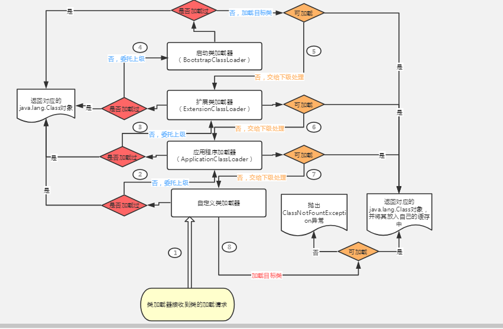
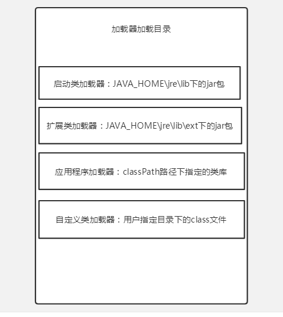

# 面试过程中被问到的问题

#### Java中有很多集合，你知道的集合有哪些，你最常使用哪一个（HashMap)？

看到这里我们自然会问：**为什么hash()函数中要用对象的hashcode与自身的高16位进行异或运算（hashcode ^ (hashcode >>> 16)）？**

这是一个很精妙的设计：

a:其实我们大可以直接用对象的hashcode直接作为下标来存储对象，这个值对于不同的对象必须保证唯一（JAVA规范），这也是大家常说的，重写equals必须重写hashcode的重要原因。但是对象的hashcode返回的是一个32位的int,那这个数组就有40亿左右，大部分情况下我们不需要这么长的数组，我们只需要低位就行，比如只根据低16位创建数组，那数组长度大概就只需要6万多，但是直接创建6万多长度的数组肯定也不合理，而且只取低16位的随机性肯定没有取32位的随机性大，冲突概率也更高，那JDK如何解决的呢？

b:JDK的处理非常巧妙，hashcode ^ (hashcode >>> 16) 该运算是用对象的hashcode与自己的高十六位进行异或运算，这样计算出来的hash值同时具有高位和低位的特性，这样算出来的hash值可以说就是一个增大了低十六位随机性的hashcoede。这样我们试想一下：只要对象的32位hashcode有一位发生了变化，那返回的hash值就会发生变化，更厉害的是不管这发生变化的那一位是高16位还是低16位，最后低十六位都会被影响到，这样也使得后面取模运算下标时所截取的低位的随机性增加，所计算出来的下标更加随机和均匀；

**为什么JDK中要用h & (length-1)来计算元素存储位置下标？**

计算元素的存放位置，我们首先想到的是根据对象的hash值对数组长度取模，这样元素的分布也还算均匀，但是取模运算效率不算高，所以JDK采用了h & (table.length -1)来得到该对象的保存位，数组长度是2的整次幂时，（数组长度-1）正好相当于一个“低位掩码”，“与”操作的结果就是散列值的高位全部归零，只保留低位值，用来做数组下标访问。以初始长度16为例，16-1=15。2进制表示是00000000 00000000 00001111。“与”操作的结果就是截取了最低的四位值。也就相当于取模操作，而且经过前面的hash()函数的的处理，低位的随机性增加了，所以可知最后运算得到的存储下标也会更加随机更加均匀。

**综上：当length = 2^n时，不同的hash值发生碰撞的概率比较小，这样就会使得数据在table数组中分布较均匀，查询速度也较快。**

HashMap：

1. 无序随机且可重复，线程不安全
2. HashMap通过put()和get()存取对象，当将键值对传递给put()时，他会调用调用对象的hashCode()方法来计算hashcode，然后来找到Bucket（桶）位置存储对象。当调用get()获取对象时，会调用equals()方法来找到键值对，然后返回对象。
3. 哈希冲突的解决方法  
   - **开放定址法**：所谓的开放定址法就是一旦发生了冲突，就去寻找下一个空的散列地址，只要散列地址表足够大，空的散列地址总能找到，并将记录存入
   - **再哈希法**：再哈希法又名双哈希法，有多个不同的hash函数，当发生冲突时，使用第二个第三个.......等哈希函数。
   - **链地址法**：链地址法的基本思想是每个哈希表节点都有一个next指针，多个哈希表节点可以用next指正构成一个单向链表，被分配到同一个索引上的多个节点可以用单向链表连接起来
   - **建立公共溢出区**：这种方法的基本思想是将哈希表分成基本表和溢出表两部分，凡是和基本表发生冲突的元素，一律填入溢出表。

#### 线程和进程的区别

1. 进程：是并发执行的程序，在执行过程中分配和管理资源的基本单位，是一个动态概念，竞争计算机系统资源的基本单位

2. 线程：是进程的一个执行单元，是进程内协调的实体。

3. 进程和线程的区别：

   - 地址空间
   - 资源拥有
   - 一个进程崩溃后，在保护模式下不会对其他进程产生印象，但是一个线程崩溃整个进程都死掉。
   - 进程切换时，消耗的资源大，效率高。所以涉及到频繁的切换时使用线程要比进程要好。同样如果要求并行且共享变量的并发操作，只能用线程不能用进程。
   - 执行过程
   - 线程是处理器调度的基本单位，但是线程不是。
   - 两者均可并发执行
   - 什么地方会用到多线程：耗时任务；后台特殊任务，比如说监控、日志、配置更新
   - 多线程实现的几种方式：
     1. 继承Thread类，重写run()方法
     2. 实现Runnable接口（Callable接口），重写run()方法。
   - 多线程的两种实现方式的区别：
     1. Thread是Runnable接口的子类，实现Runnable接口的方式解决了Java单继承的局限。
     2. Runnable接口实现多线程比继承Thread类更加能描述任务的概念
   - 多线程有几种实现同步方法: 同步的实现方面有两种，分别是synchronized,wait与notify
     1. wait():使一个线程处于等待状态，并且释放所持有的对象的lock。
     2. sleep():使一个线程处于睡眠状态，是一个静态方法，调用此方法需要捕捉中断异常。
     3. notify():唤醒一个处于等待状态的线程，注意的是在调用此方法的时候，并不能确定唤醒哪一个等待状态的线程，而是由JVM确定唤醒哪个线程，而且不是按优先级。
     4. Allnotify():唤醒所有处于等待的线程，继续竞争CPU资源。

   - 产生死锁的原因（四个必要条件）
     1. 互斥条件
     2. 请求与保持条件
     3. 不剥夺条件
     4. 循环等待条件

#### JVM虚拟的组成。

双亲委派机制

#### 类加载器

 **类加载器通常无须等到“首次使用”该类时才加载该类，Java虚拟机规范允许系统预先加载某些类。**

加载（隐形和显性加载，可以从本地文件系统 这里面就包括了Jar和.Class文件 网络流 这里面就要讲到流对象和序列化的问题了  ）

验证(**文件格式验证** **元数据验证 ** **字节码验证** **符号引用验证**) 

准备 (类准备阶段负责为类的静态变量分配内存，并设置默认初始值。)

解析 (将类的二进制数据中的符号引用替换成直接引用。)

初始化 

使用 

卸载

#### 如何解决哈希冲突

- **开放定址法**：所谓的开放定址法就是一旦发生了冲突，就去寻找下一个空的散列地址，只要散列地址表足够大，空的散列地址总能找到，并将记录存入
- **再哈希法**：再哈希法又名双哈希法，有多个不同的hash函数，当发生冲突时，使用第二个第三个.......等哈希函数。
- **链地址法**：链地址法的基本思想是每个哈希表节点都有一个next指针，多个哈希表节点可以用next指正构成一个单向链表，被分配到同一个索引上的多个节点可以用单向链表连接起来
- **建立公共溢出区**：这种方法的基本思想是将哈希表分成基本表和溢出表两部分，凡是和基本表发生冲突的元素，一律填入溢出表。