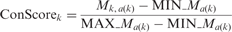
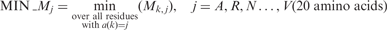
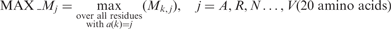
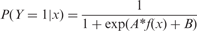
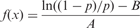

# 基于蛋白质序列信息的锌离子结合位点预测

Nanjiang Shu, Tuping Zhou and Sven Hovmo¨ ller*

斯德哥尔摩大学阿伦尼乌斯结构化学实验室，SE-106 91瑞典斯德哥尔摩

2007年10月18日收到； 于2007年12月9日修订； 2007年12月11日接受
Advance Access 出版物 2008年2月1日
副主编：Burkhard Rost

---

#### 摘要

**动机：**鉴于锌离子在生物学和生理上的功能的丰富性、重要性和独特性，我们开发了一种基于蛋白质序列的锌离子结合位点预测的改进方法。

**结果：**通过结合支持向量机（SVM）和基于蛋白质同源性的预测，通过对蛋白质数据库（PDB)的一组非冗余蛋白质链（2727条蛋白质链，其中包含235条与锌离子结合）锌进行k折交叉验证，我们的方法预测离子结合Cys、His、Asp和Glu的准确率为75%（Cys和His的准确度为86%），召回率在50%。同时，与最近发布的在同一数据集上进行测试的方法相比，我们的方法在不同的召回水平下预测结合锌的Cys和His的精度要高10％。

**资源获取：**项目程序可以在 www.fos.su.se/~nanjiang/zincpred/download/ 下载

**联系方式：**svenh@struc.su.se

**补充资料：**所有补充资料都可以在 www.fos.su.se/~nanjiang/zincpred/suppliment获得

#### 介绍

   ​		蛋白质数据库（PDB）中大约有三分之一的蛋白质含有金属离子，据估计所有蛋白质中大约有相同比例的是金属蛋白质。金属原子对蛋白质的功能，结构和稳定性至关重要。锌是在真核生物中发现的第二种（仅次于铁）最丰富的金属。锌在许多生物学功能中起着重要的作用，主要是催化作用和结构作用。例如，锌离子在许多水解酶和裂解酶中充当强大的亲电催化剂。锌结合稳定了结构域的折叠构象，从而使蛋白质可以正常发挥功能，例如锌指蛋白。锌的生物学作用已得到广泛的综述。锌结合位点的准确预测不仅对蛋白质的功能注释很重要，而且对三维结构预测也有帮助。

   ​		目前已经有学者基于结构信息预测了金属结合位点。来自蛋白质序列的预测仅受到较少的关注。可以在**Nakata** 等人的工作中找到早期方法。他们试图用神经网络预测锌与DNA结合蛋白。这些方法受到当时数据缺乏的限制，并且该方法仅适用于某些类型的锌结合蛋白。**Andreini**使用了**PHI-BLAST**提供的正则表达式匹配方法以探索结合模式。他们表明，当通过**PHI-BLAST**在金属结合图谱周围排列的相同氨基酸的百分比相对于蛋白质结构域长度> 20％时，扫描图谱与铜结合的置信度> 90％。但是，没有锌结合位点的成功率。**Menchetti** 等人在从序列预测锌结合位点方面取得了突破。2007年在他们的工作中，使用支持向量机（**SVM**）通过局部预测因子和门控预测因子预测了锌结合残基。对于本地预测变量，将选择所有Cys和His（CH）。代表以所选CH为中心的残基窗口的特征向量由来自**PSI-BLAST**的位置特异性取代矩阵（PSSM）编码。对于门控预测因子，通过用半模式[CH] *x*（0-7）[CH] 扫描氨基酸序列来挑选残基对（C是半胱氨酸，H是组氨酸，*x*（0-7）代表长度为0至7的任何氨基酸的连续子串。这些选择的残基对的编码与本地预测变量中的编码相似。门控预测器通过门控网络将局部预测器和半模式预测器的预测组合在一起。他们的方法基于5倍交叉验证，预测了与锌结合的Cys和His的准确度为60％，召回率为60％。对于不太常见的锌结合残基Asp和Glu**，**结果不太令人满意。**Passerini** 描述了一种基于两阶段机器学习方法预测金属结合Cys和His的方法。第一步与**Menchetti** *等人*的局部预测变量相似。使用**PSSM**和全局描述符（例如蛋白质长度和氨基酸组成）将单个Cys和His编码为特征向量。然后通过**SVM**对这些特征向量进行分类。之后，使用三层双向递归神经网络（**BRNN**）进一步区分金属结合和非金属结合的Cys和His。对于结合锌的Cys和His，**SVM-BRNN**的预测准确率为75％，召回率为50％。

   ​		沉积在PDB中的高质量结构数量的迅速增加以及**PSI-BLAST**的可用性（在蛋白质家族之间提供可靠的多序列比对），鼓励我们使用进化信息从数据库规模的序列中预测锌结合蛋白。 我们开发了一种改进的方法来预测序列中的锌结合位点，重点是四个氨基酸Cys，His，Asp和Glu（CHDE），因为这四个氨基酸约占所有锌结合残基的96％。该方法在与**Passerini** *等人*相同的非冗余PDB链组上进行了测试。

**表1. 每种锌原子上结合的残基数**

|         |  C   |  H   |  D   |  E   | Others | Subtotal | No. of Zn atoms | No. of chains |
| :-----: | :--: | :--: | :--: | :--: | :----: | :------: | :-------------: | :-----------: |
| $Zn1^a$ |  1   |  10  |  9   |  10  |   3    |    33    |       34        |      19       |
| $Zn2^a$ |  3   |  32  |  15  |  26  |   7    |    83    |       45        |      37       |
| $Zn3^a$ |  25  | 134  |  54  |  30  |   7    |   250    |       89        |      73       |
| $Zn4^a$ | 499  | 190  |  41  |  24  |   15   |   769    |       205       |      148      |
| $Zn5^a$ |  7   |  1   |  0   |  0   |   2    |    10    |        2        |       2       |
| $Zn6^a$ |  46  |  59  |  38  |  22  |   10   |   175    |       67        |      35       |
| $Zn7^a$ | 535  | 366  | 116  |  85  |   24   |   1136   |       375       |      235      |
| $Zn8^a$ | 531  | 325  |  92  |  51  |   24   |   1023   |       295       |      210      |

   $^aZn1$, $Zn2$, $Zn3$, $Zn4$ and $Zn5$都是锌原子,分别结合到1，2，3，4和5个氨基酸残基。$^b Co-catalytic Zn$：锌原子与3、4或5个氨基酸结合，并通过侧链原子或水分子与另一个金属原子桥接。$c Zn3$，$Zn4$，$Zn5$和$^b Co-catalytic Zn$。

   

#### 方法

   ​		我们的方法包括一个基于SVM的预测器和一个基于同源性的预测器。对于基于SVM的预测变量，在训练集和测试集中都选择了CHDE，并将其编码为单点载体和基于对的载体，它们代表分别位于每个选定的CHDE或一对选定的CHDE中心的残基窗口。然后选用径向基函数的SVM用于训练训练集的特征向量并在测试集上进行预测。通过使用单位点矢量和基于对的矢量与门控网络相结合的预测，可以获得对单个选定残基的SVM预测。对于基于同源性的预测因子，使用片段匹配方法在训练集中针对远程同源物搜索测试集中的每个目标链。锌结合残基的预测是根据训练集中的预测同源物进行的。通过SVM预测和基于同源性的预测的共识获得最终预测。整个预测过程如图1所示。

   **图1**

   

   总体预测方法的流程图。SVM预测和基于同源性的预测被合并到最终共识预测中。

   

##### 位置特异性矩阵（PSSM）和级别保护（ conservation level）

​		通过对NCBI nr数据库（版本2006年4月）运行PSI-BLAST（版本2.2.13）获得三个*E*值阈值为0.001的迭代，从而获得PSSM配置文件。序列ConScore *k中*残基*k*的保守分数计算如下： 

（1）

 

（1.1）

 

（1.2）

​		其中*一个*（*ķ*）是氨基酸型残基的（20种氨基酸之一）*ķ*中，M *ķ*，一个（*ķ*）是在位置轮廓的对数奇数得分*ķ*（在每个序列位置上的配置文件包含20上氨基酸对应于20个氨基酸）项*一*（*ķ*），MAX_M *Ĵ*和MIN_M *Ĵ*是最大和用于与氨基酸类型的所有残基型材最小数奇数分数*Ĵ*上氨基酸*Ĵ*。保存分数的范围从0（未保存）到1（最高保存）。例如，对于半胱氨酸，MAX_M Ç= 12和MIN_M Ç = -5。对于C（半胱氨酸）的对数得分等于7的Cys，保守得分计算为0.71。

---

##### 基于SVM的预测器

​		特征向量代表了选择的锌结合或不结合的氨基酸的保守性和理化性质。支持向量机用于将这些特征向量分类为正（锌结合）或负（非锌结合）。单点载体代表以每个选定的CHDE为中心的残基窗口。使用单点向量的SVM预测得出了所有CHDE的基本预测。具有生物学意义的Zn原子（即Zn3和Zn4）与3个或4个残基结合，并且这些残基有望相互关联。基于对的载体通过将一对选定的CHDE作为窗口中的中心残基来解释这些残基之间的相关性。通过单门向量和基于对的向量的SVM预测通过**Menchetti** *等人*的门控网络进行了合并。使用**Platt**建议的S型函数，将SVM输出转换为条件概率，以便可以通过门控网络对其进行组合。乙状结肠功能定义为 

（2）

​		其中*x*是每个测试实例的SVM输入，*f（x）*表示测试实例*x*的余量*，P*（*Y* = 1 | *x*）是锌结合预测的概率，*A*和*B*分别是斜率和偏移从[ 乙状结肠功能训练集]中学习[通过普拉特建议的三重交叉验证方法]。根据经验，单点向量可以使用*A* = −2.0，*B* = −0.5，*A* = −4.0，*B*= -0.5对于基于对的向量。为了使门控网络的SVM预测分数与基于同源性的预测分数线性组合，我们将条件概率转换为SVM功能裕度，方法是 

（3）

​		其中*f*（*x*）是每个测试实例*x*的SVM预测得分*，p*是通过门控网络进行锌结合的条件概率，*A*和*B*与在S型函数中使用的相同。等式（[3](https://academic.oup.com/bioinformatics/article/24/6/775/192764#M3)）实际上是等式（[2](https://academic.oup.com/bioinformatics/article/24/6/775/192764#M2)）的逆函数。

​		为了选择残基对，**Menchetti** 等人。采用[CHDE] *x*（0-7）[CHDE]半模式（表示C，H，D或E，然后是0、7个残基内的C，H，D或E）来挑选这样的对。但是，该方法错过了所有结合锌的CHDE的约40％（[表2](javascript:;)）。我们首先通过选择所有保守性分数≥0.75的CHDE，然后从序列中分离出少于150个残基的所有这些保守的CHDE对来选择残基对。我们的方法鉴定出更多的锌结合型CHDE，残留物更少（[表2](javascript:;)）。有关单位向量和基于对的向量的编码的详细信息，请参见补充数据。

**表2**

通过基于高度保守的CHDE和半模式[CHDE] x（0,7）[CHDE]的配对选择方法选择的锌结合残基（与Zn3，Zn4，Zn5和Co催化锌结合的残基）的比较

| Method              | No. of selected residues | No. of selected zinc- binding residues | Recall (%) | Precision (%) |
| :------------------ | :----------------------- | :------------------------------------- | :--------- | :------------ |
| $Conserved CHDEs^a$ | 12969                    | 869                                    | 87.0       | 6.7           |
| $Semi-pattern^b$    | 59642                    | 611                                    | 61.2       | 1.0           |

​		$^aResidues$（方法中所述）≥0.75的残基被认为是高度保守的。该对中的残基顺序被少于150个残基隔开。$^bSemi-pattern$[CHDE] x（0,7）[CHDE]是指Menchetti *等人*在0至7个残基内的C，H，D或E，然后是C，H，D或E。

---

##### 基于同源性的预测因子

​		一般而言，如果蛋白质具有与锌结合的同源蛋白质，则该蛋白质也与锌结合的可能性要高得多，尤其是当该蛋白质具有与同源锌结合蛋白质相似的序列模式时。因此，如果在训练集中发现一条链的相似性得分（请参见[第2.4.2节](https://academic.oup.com/bioinformatics/article/24/6/775/192764#SEC2.4.2)）高于某个阈值（例如25.0），则使用诸如金属结合位点和二硫键之类的信息来计算锌结合得分用于目标链的选定CHDE。如果在检测到的链中匹配的区域是ZS，则定义为ZS = SS *等级，其中SS是预测的远程同源物的同源性得分（在[2.4.2节中](https://academic.oup.com/bioinformatics/article/24/6/775/192764#SEC2.4.2)描述）。规模定义为/ 50，其中N是目标链预测的同源物数目。量表除以50，以使从预测的同源物得出的平均ZS得分与从SVM预测得到的平均得分相同。计算目标链各个残基的锌结合分数，作为从该链的所有预测同源物得出的相似性分数的平均值。

- 非锌结合，对所有选定的CHDE设置负分数-ZS
- 二硫键，对所有半胱氨酸设置负分数-ZS。
- 锌结合可为残基组设置正分数ZS，该残基最匹配与Zn原子结合的残基模式。

##### 查找远程同源物的片段匹配方法

通过片段匹配法预测同源物。它包含两个步骤。

- 段匹配
  
  对于测试集中的每个链，针对训练集中的所有9个残基片段搜索9个残基的滑动窗口（请注意，此处的窗口与SVM特征向量编码中使用的窗口不同，前者的中心位于任意序列中的残基，而后者集中在选定的CHDE上）。此九残基片段与其训练集中的相应片段之间的相似性定义为 
  
  [](https://oup.silverchair-cdn.com/oup/backfile/Content_public/Journal/bioinformatics/24/6/10.1093_bioinformatics_btm618/2/btm618m6.gif?Expires=1591519506&Signature=fbfTTiXHBZBvZ~rRh0Q2-VW4~GYi8YG2N0XowmjdATiml9qbjnntsUhCtkGboM5ULt3ZcpGSYqu~O4SUwg7bN1q91bakQ~RhGag-XQ5KsD86Ixet32tAcqNzHutP-FHFfkQfpxBM4ezSSYf661ppqUVH2VCe15gij-u9wP53l6BjnTsXlw9UG0EZkdpIo4QqLs6hgtxZuc5T-MJTiPc54ECNeUzS0Sg5rFI4x4kxitdXeuX77lJrDgflO3wa4F-Va7nUo4SbXpeI33Ksqa5wVLLr-3w16t-vSonQKGmKPSmivTBbCEEZoOwtxZImf0h6HORW4qkC02hvpPJ3eo2TXg__&Key-Pair-Id=APKAIE5G5CRDK6RD3PGA)
  
  （4）
  
  其中α和β是测试集中9个残基片段和训练集中相应片段的谱图，*P*是20个氨基酸的背景频率。两个残基位置之间的分布图谱得分与Mittelman *等人*建议的PICASSO3得分相同*。*（[2003](javascript:;)）。
  
- 查找远程同源
  
  对于测试集中的一条链的每个片段，保留训练集中的多达100个片段，这些片段具有等式（[4](https://academic.oup.com/bioinformatics/article/24/6/775/192764#M4)）中定义的最高相似性评分，包括PDB代码和这些最接近匹配中每个片段的片段位置。如果训练集中存在同源蛋白链，则该链中的许多片段往往与目标链中的相应片段具有很高的相似性评分，这意味着该链的PDB代码将频繁出现在匹配片段列表中。我们通过以下方式利用它来查找远程同源物。对于列表中经常出现的那些蛋白质链（通常大于序列残基数的10％），进行了点图绘制。通过设置*X*绘制此图值作为目标链在测试集中的9个残基片段的中心残基的位置，*Y*值作为匹配列表中相应链段的位置（见图[2）](javascript:;)一个）。这种图上的点往往会聚集成连续的线。这并不奇怪，因为两个相邻的九个残基片段共有八个残基，因此通常会从同一蛋白质中拾取两个相邻的九个残基片段。当这种图仅由几条长的连续点线组成时，匹配的蛋白质很可能与测试集中的靶链同源。从图案的长度和线性除以这两条链的平均序列长度得出同源性得分。得出同源性得分的算法总结如下：
  
  **图2**
  
  ![（A）1EG9A（449个氨基酸）和1FQTA（112个氨基酸）和（B）1FLGA（582个氨基酸）和1GYCA（499个氨基酸）之间匹配的9个残基片段的中心残基的序列号的点图。 点图上的每个点代表一对九残基长片段，它们具有较高的相似性评分，如公式（4）所定义。 在（A）的点图中，较高的同源性得分（分数= 41，当在阈值25处切割同源性得分时，根据SCOP（Andreeva et al。，2004），所有预测的同源物中有86％是真实的同源物。 3.2节是根据连续且线性分布的点预测的。 凭直觉，人们还会期望1FQTA [1：100]和1EG9A [40：150]之间具有同源性，实际上，根据SCOP定义，它们是同源的（这两个域属于同一SCOP超家族，即ISP域）。 这两个结构域之间的序列同一性仅为15％，这表明分段匹配方法在远程同源性检测中是成功的。 实心箭头标记的连续点段预测1FQTA和1EG9A之间的保守同源区域。 用虚线箭头标记的间隙预测了变化的区域，而用虚线箭头标记的间隙预测了该序列的该区域中链1FQTA的插入或1EG9A的缺失。 另一方面，在（B）的点图中，尽管也有大量的点，但是点没有像（A）那样形成长线。 预测1FLGA和1GYCA之间的同源性评分较低（得分= 6），这意味着它们不太可能同源。 实际上，根据SCOP定义，1FLGA和1GYCA不是同源的（它们在SCOP中属于不同的折叠，见b.70.1）。](Prediction of zinc-binding sites in proteins from sequence.assets/m_btm618f2.jpeg)
  
  点图（**A**）1EG9A（449个氨基酸）和1FQTA（112个氨基酸）和（**B**）1FLGA（582个氨基酸）和1GYCA（499个氨基酸）之间的匹配的9个残基片段的中心残基的序列号。点图上的每个点代表一对九残基长片段，它们具有较高的相似性评分，如公式（[4](https://academic.oup.com/bioinformatics/article/24/6/775/192764#M4)）中所定义。在（A）的点图中，较高的同源性得分（分数= 41，当在阈值25处切割同源性得分时，根据SCOP（Andreeva *et al。*，[2004](javascript:;)），所有预测的同源物中有86％是真实的同源物*。*[第3.2节](https://academic.oup.com/bioinformatics/article/24/6/775/192764#SEC3.2)）是根据连续且线性分布的点预测的。凭直觉，人们还会期望1FQTA [1：100]和1EG9A [40：150]之间具有同源性，实际上，根据SCOP定义，它们是同源的（这两个域属于同一SCOP超家族，即ISP域）。这两个结构域之间的序列同一性仅为15％，这表明分段匹配方法在远程同源性检测中是成功的。实心箭头标记的连续点段预测1FQTA和1EG9A之间的保守同源区域。用虚线箭头标记的间隙预测了变化的区域，而用虚线箭头标记的间隙预测了该序列的该区域中链1FQTA的插入或1EG9A的缺失。另一方面，在（B）的点图中，点不像（A）那样形成长线，虽然也有很多点 预测1FLGA和1GYCA之间的同源性评分较低（得分= 6），这意味着它们不太可能同源。实际上，根据SCOP定义，1FLGA和1GYCA不是同源的（它们在SCOP中属于不同的折叠，1FLGA为b.70.1.1，1GYCA为b.6.1.3）。
  
  ![Dot plots for the sequence number of the central residue of matched nine-residue segments between (A) 1EG9A (449 amino acids) and 1FQTA (112 amino acids) and (B) 1FLGA (582 amino acids) and 1GYCA (499 amino acids). Each dot on the dot plots represents a pair of nine-residue long fragments with high similarity score as defined in Equation (4). In the dot plot of (A), a high homology score (score = 41, when cutting the homology score at threshold 25, 86% of all predicted homologues are real homologues according to the SCOP (Andreeva et al., 2004), see Section 3.2) was predicted from consecutively and linearly distributed dots. Intuitively, one would also expect homology between 1FQTA [1:100] and 1EG9A [40:150], and in fact, they are homologous according to the SCOP definition (these two domains belong to the same SCOP superfamily, the ISP domain). The sequence identity between these two domains is barely 15%, showing the success of the Segment Matching Method in remote homology detection. The consecutive dot segments as marked by solid arrows predicted the conserved homologous regions between 1FQTA and 1EG9A. Gaps marked by dashed arrows predicted the varied regions and the gap marked by the dashed-dot arrow predicted an insertion in the chain 1FQTA or deletion in 1EG9A in that region of the sequence. On the other hand, in the dot plot of (B), the dots are not forming long lines as in (A), though there are also a great number of dots. Low homology score (score = 6) was predicted between 1FLGA and 1GYCA meaning that they are not likely to be homologous. In fact, 1FLGA and 1GYCA are not homologous according to the SCOP definition (they belong to different folds in the SCOP, b.70.1.1 for 1FLGA and b.6.1.3 for 1GYCA).](https://oup.silverchair-cdn.com/oup/backfile/Content_public/Journal/bioinformatics/24/6/10.1093_bioinformatics_btm618/2/m_btm618f2.jpeg?Expires=1591519506&Signature=nn1oF1hpOIoHoyibe6ysZlGR5ZZXODLKBDJI2C4FgOCLzT5X2jbBwXMCXaMe9ZTI3ih1kgyIp7L-lSEo3oNCa6Lavo~qqbO0rT3IX3mXxukS4tK09IJ5LgIM~2qfaxeEI13EjcAcASOxzqgOttwf40D5CSQ6xJpmuDwJRwcBgAxhN~lUKGWR-LVgQEb6t68~I4ijpnM4H2H3xBslY~ZIhDjy7iQ4iEXDTwaIEb6BiFxTariWsdCSxmHhdcVT26U4cpswLaBqNwlcSX8LhwucAvPo6MUPw17XmLZmep8-ZpxcbQSDMlX1daSDyZuvqOPznR~NIXhD22keSoMZMeroeQ__&Key-Pair-Id=APKAIE5G5CRDK6RD3PGA)
  
  **在点图上初始化分数：**
  
  对于点图上的每个对角线
  
  1. 将每个点的分数设置为连续点的数量
  2. 记录对角线的位置以及前10个最长的连续点线段
  
  **计算整个链的同源性得分：**
  
  ​		将所有对角线的最高同源性得分设置为整个链的同源性得分
  
  通过将最低的同源性得分设置为0，将最高的同源性得分设置为100，将所有预测的同源物的同源性评分标准化为[0，100]。对于多域序列，还根据这些线性范围的程度来预测同源性部分的范围和连续模式。在某些情况下，从一条链中检测到许多高得分的9个残基片段，但它们相当随机地分布在点图上（参见[图2](javascript:;) B）。我们没有预料到这种情况可能是同源物。
  
   **性能评估：**
  
  ​		精密度定义为 $TP /（TP + FP）$，其中$TP$（真实阳性）是指正确识别的阳性实例（与锌结合的残基或蛋白质）的数量；$FP$（假阳性）是被错误地预测为阴性的阴性例子（尽管根据PDB不能与锌结合的残基或蛋白质，但预计会结合锌）。召回定义为$TP /（TP + FN）$，其中$FN$（假阴性）是被错误地预测为阴性的阳性示例的数量。在这项工作中，负面的例子远远超过正面的例子。CH和CHDE的负对正比分别为26：1和93：1。对于这种不平衡的数据集，接收器工作特性（ROC）曲线可能会过于乐观地表示方法的性能（Davis和Goadrich，[2006](javascript:;)）。提出了用Recall-Precision曲线绘制精确度与Recall的关系曲线，以替代ROC曲线来处理类分布不平衡的数据集（Zhang *等人*，[2004年](javascript:;)）。在我们的方法中，召回精度曲线下的面积（AURPC）用于模型选择和性能测量。AURPC是通过Davis和Goadrich（[2006](javascript:;)）提出的方法计算的。
  
  **数据与统计:**
  
  ​		我们使用了一组非冗余的PDB，其中包含Passerini *等人*使用的2727个蛋白质序列。该数据集由uniqueProt在零HSSP（从蛋白质组学获得同源性的同源性）距离处剔除（Mika和Rost，[2003年](javascript:;)）。这些2727链包含564444个残基，包括9202$ Cys$，13663$ His$，32466$ Asp$和38299 $Glu$。在这2727条链中，731与至少一个金属原子结合。在这731条链中，有235条与至少一个Zn原子结合（请参阅补充数据）。如[表1](javascript:;)所示，与锌结合的残基总数刚刚超过1000。。如果链上残基的任何氮，氧或硫原子位于距金属原子3.0埃以内，则认为金属原子与蛋白质链结合[有关金属与残基原子之间的特定距离，请参见Harding（[2004](javascript:;)）]。 。手动固化一些原子（例如，在$1I3QA$，$1I3QL$，$1IRXA$，$1CVRA$和$1PGUA$链中）与Zn原子之间的残基，使其与锌结合（参见补充数据）。因此，Zn原子和与锌结合的Cys的数目及其His与Passerini *等人*略有不同。
  
  ​		大多数锌原子（78％，请[参见表1](javascript:;)）与三个或四个残基结合（称为$Zn3$和$Zn4$，我们将由*m个*残基配位的Zn原子标注为Zn *m*），即所有结合锌的$Cys$，$His$，$Asp$和90％。 $Glu$被$Zn3$或$Zn4$结合。结合四个残基但不结合水分子的锌原子被认为是结构性锌，而结合三个残基的锌原子通常是催化性锌（**Auld**，[2001](javascript:;)）。含有$Zn3$和$Zn4$的蛋白质的一个例子是醇脱氢酶，PDB代码$2OHX$（**Al-Karadaghi *et al.***,[1994](javascript:;)）（有关结构的说明，请参见补充数据）。许多$Zn3$和$Zn4$原子附近都有其他金属原子，这些金属原子由侧链原子或水分子桥接。锌酶的活性需要这些桥接的金属原子共同作用。这样的$Zn$原子称为助催化锌。通常只结合一个或两个残基的Zn原子通常位于蛋白质表面。它们最有可能在结晶过程中与蛋白质结合（**McPherson**，[1999](javascript:;)），但没有生物学功能。我们在此集中于预测生物学上重要的锌结合位点，即结构（$Zn4$），催化性（$Zn3$）和助催化锌结合位点。链间$Zn$原子，例如与一个链中的两个残基和另一个链中的一个残基结合的$Zn$原子，以及一个$Zn5$原子（请参阅**表1**）也包括在内。总共有295个这样的锌原子，与531$ Cys$，325$ His$，92 $Asp$和51 $Glu$结合（**表1**）。
  
  ## 3结果与讨论

