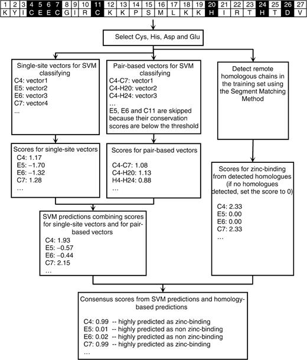

# Prediction of zinc-binding sites in proteins from sequence 

# 基于蛋白质序列信息的锌离子结合位点预测

Nanjiang Shu, Tuping Zhou and Sven Hovmo¨ ller*

斯德哥尔摩大学阿伦尼乌斯结构化学实验室，SE-106 91瑞典斯德哥尔摩

2007年10月18日收到； 于2007年12月9日修订； 2007年12月11日接受
Advance Access 出版物 2008年2月1日
副主编：Burkhard Rost

---

#### 摘要

**动机：**鉴于锌离子在生物学和生理上的功能的丰富性、重要性和独特性，我们开发了一种基于蛋白质序列的锌离子结合位点预测的改进方法。

**结果：**通过结合支持向量机（SVM）和基于蛋白质同源性的预测，通过对蛋白质数据库（PDB)的一组非冗余蛋白质链（2727条蛋白质链，其中包含235条与锌离子结合）锌进行k折交叉验证，我们的方法预测离子结合Cys、His、Asp和Glu的准确率为75%（Cys和His的准确度为86%），召回率在50%。同时，与最近发布的在同一数据集上进行测试的方法相比，我们的方法在不同的召回水平下预测结合锌的Cys和His的精度要高10％。

**资源获取：**项目程序可以在 www.fos.su.se/~nanjiang/zincpred/download/ 下载

**联系方式：**svenh@struc.su.se

**补充资料：**所有补充资料都可以在 www.fos.su.se/~nanjiang/zincpred/suppliment获得

1. #### 介绍

   ​		蛋白质数据库（PDB）中大约有三分之一的蛋白质含有金属离子，据估计所有蛋白质中大约有相同比例的是金属蛋白质。金属原子对蛋白质的功能，结构和稳定性至关重要。锌是在真核生物中发现的第二种（仅次于铁）最丰富的金属。锌在许多生物学功能中起着重要的作用，主要是催化作用和结构作用。例如，锌离子在许多水解酶和裂解酶中充当强大的亲电催化剂。锌结合稳定了结构域的折叠构象，从而使蛋白质可以正常发挥功能，例如锌指蛋白。锌的生物学作用已得到广泛的综述。锌结合位点的准确预测不仅对蛋白质的功能注释很重要，而且对三维结构预测也有帮助。

   ​		目前已经有学者基于结构信息预测了金属结合位点。来自蛋白质序列的预测仅受到较少的关注。可以在**Nakata** 等人的工作中找到早期方法。他们试图用神经网络预测锌与DNA结合蛋白。这些方法受到当时数据缺乏的限制，并且该方法仅适用于某些类型的锌结合蛋白。**Andreini et al**使用了**PHI-BLAST**提供的正则表达式匹配方法以探索结合模式。他们表明，当通过**PHI-BLAST**在金属结合图谱周围排列的相同氨基酸的百分比相对于蛋白质结构域长度> 20％时，扫描图谱与铜结合的置信度> 90％。但是，没有锌结合位点的成功率。**Menchetti** 等人在从序列预测锌结合位点方面取得了突破。2007年在他们的工作中，使用支持向量机（**SVM**）通过局部预测因子和门控预测因子预测了锌结合残基。对于本地预测变量，将选择所有Cys和His（CH）。代表以所选CH为中心的残基窗口的特征向量由来自**PSI-BLAST**的位置特异性取代矩阵（PSSM）编码。对于门控预测因子，通过用半模式[CH] *x*（0-7）[CH] 扫描氨基酸序列来挑选残基对（C是半胱氨酸，H是组氨酸，*x*（0-7）代表长度为0至7的任何氨基酸的连续子串。这些选择的残基对的编码与本地预测变量中的编码相似。门控预测器通过门控网络将局部预测器和半模式预测器的预测组合在一起。他们的方法基于5倍交叉验证，预测了与锌结合的Cys和His的准确度为60％，召回率为60％。对于不太常见的锌结合残基Asp和Glu**，**结果不太令人满意。**Passerini** 描述了一种基于两阶段机器学习方法预测金属结合Cys和His的方法。第一步与**Menchetti** *等人*的局部预测变量相似。使用**PSSM**和全局描述符（例如蛋白质长度和氨基酸组成）将单个Cys和His编码为特征向量。然后通过**SVM**对这些特征向量进行分类。之后，使用三层双向递归神经网络（**BRNN**）进一步区分金属结合和非金属结合的Cys和His。对于结合锌的Cys和His，**SVM-BRNN**的预测准确率为75％，召回率为50％。

   ​		沉积在PDB中的高质量结构数量的迅速增加以及**PSI-BLAST**的可用性（在蛋白质家族之间提供可靠的多序列比对），鼓励我们使用进化信息从数据库规模的序列中预测锌结合蛋白。 我们开发了一种改进的方法来预测序列中的锌结合位点，重点是四个氨基酸Cys，His，Asp和Glu（CHDE），因为这四个氨基酸约占所有锌结合残基的96％。该方法在与**Passerini** *等人*相同的非冗余PDB链组上进行了测试。

   ##### **表格1**. 每种锌原子上结合的残基数

   |         |  C   |  H   |  D   |  E   | Others | Subtotal | No. of Zn atoms | No. of chains |
   | :-----: | :--: | :--: | :--: | :--: | :----: | :------: | :-------------: | :-----------: |
   | $Zn1^a$ |  1   |  10  |  9   |  10  |   3    |    33    |       34        |      19       |
   | $Zn2^a$ |  3   |  32  |  15  |  26  |   7    |    83    |       45        |      37       |
   | $Zn3^a$ |  25  | 134  |  54  |  30  |   7    |   250    |       89        |      73       |
   | $Zn4^a$ | 499  | 190  |  41  |  24  |   15   |   769    |       205       |      148      |
   | $Zn5^a$ |  7   |  1   |  0   |  0   |   2    |    10    |        2        |       2       |
   | $Zn6^a$ |  46  |  59  |  38  |  22  |   10   |   175    |       67        |      35       |
   | $Zn7^a$ | 535  | 366  | 116  |  85  |   24   |   1136   |       375       |      235      |
   | $Zn8^a$ | 531  | 325  |  92  |  51  |   24   |   1023   |       295       |      210      |

   $^aZn1$, $Zn2$, $Zn3$, $Zn4$ and $Zn5$都是锌原子,分别结合到1，2，3，4和5个氨基酸残基。$^b Co-catalytic Zn$：锌原子与3、4或5个氨基酸结合，并通过侧链原子或水分子与另一个金属原子桥接。$c Zn3$，$Zn4$，$Zn5$和$^b Co-catalytic Zn$。

   

   

2. #### 方法

   我们的方法包括一个基于SVM的预测器和一个基于同源性的预测器。对于基于SVM的预测变量，在训练集和测试集中都选择了CHDE，并将其编码为单点载体和基于对的载体，它们代表分别位于每个选定的CHDE或一对选定的CHDE中心的残基窗口（参见[2.2节](https://academic.oup.com/bioinformatics/article/24/6/775/192764#SEC2.2)）。然后，将SVM用于训练训练集的特征向量并在测试集上进行预测。公开可用的Gist SVM软件包（版本2.1.1）（Pavlidis *等*，[2004](javascript:;)）用于实现SVM。使用了径向基核。通过使用单位点矢量和基于对的矢量与门控网络相结合的预测，可以获得对单个选定残基的SVM预测。对于基于同源性的预测因子，使用片段匹配方法在训练集中针对远程同源物搜索测试集中的每个目标链（请参见[第2.4节](https://academic.oup.com/bioinformatics/article/24/6/775/192764#SEC2.4)）。锌结合残基的预测是根据训练集中的预测同源物进行的。通过SVM预测和基于同源性的预测的共识获得最终预测。整个预测过程[如图1所示](javascript:;)。
   
   
   
   1. 位置特异性矩阵（PSSM）和级别保护（ conservation level）
   2. 
   3. 基于SVM的预测器
   4. 基于同源性的预测因子
   5. 查找远程同源物的片段匹配方法
      - 段匹配
      - 查找远程同源
   6. 性能评估

