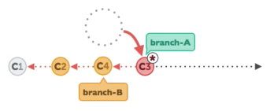

> # Git-Tutorial 基础课
>
> ​																										**苏州科技大学-计算机科学与技术**


## 介绍

#### Why Git?

1. ##### [Git官网](https://git-scm.com/)

   > Git 是一个分布式版本控制系统. 它的灵活性, 优越性使得它从2005年发布以来. 获得了越来越多的使用和支持

2. ##### 什么时候需要Git？

   - 当你已经成为码农, 或者已经在成为码农的路上;
   - 当你觉得代码太多;
   - 当你已经开始用日期或版本号命名的代码文件的时候.

3. ##### 什么样的文件可以被Git管理？

   - 文本文件 (.txt) 等;
   - 脚本文件 (.py) 等;
   - 各种基于文本信息的文件.

#### Git 安装

1. ##### Windows系统为例

   - 打开[Git官网](https://git-scm.com/)

     

   - 下载对应操作系统的Git安装包

     

   - 点击安装，傻瓜无脑


## 创建/修改 版本库

#### 第一个版本库 **Repository**

1. ##### 创建版本库 (init) 

   - 我们先要确定要把哪个文件夹里的文件进行管理. 比如说我桌面上的一个叫 `git_project` 的文件夹. 然后在 Terminal (Windows 的 git bash) 中把当前目录调到这个文件夹 `git_project`, 我的做法是这样:

     ```bash
     cd C:\Users\Administrator\Desktop\git_project
     ```

   - 为了更好地使用 git, 我们同时也记录每一个施加修改的人. 这样人和修改能够对应上. 所以我们在 git 中添加用户名 `user.name` 和 用户 email `user.email`:

     ```bash
     git config --global user.name "modianor"
     git config --global user.email "1138716463@qq.com"
     ```

   - 然后我们就能在这个文件夹中建立 git 的管理文件了:

     ```bash
     git init
     ```

   

2. ##### 添加文件管理 (add)

   - 建立一个新的 `1.py` 文件:

     ```bash
     touch 1.py
     ```

   - 现在我们能用 `status` 来查看版本库的状态:

     ```bash
     git status
     ```

   - 现在 `1.py` 并没有被放入版本库中 (unstaged), 所以我们要使用 `add` 把它添加进版本库 (staged):

     ```bash
     git add 1.py
     ```

   - 如果想一次性添加文件夹中所有未被添加的文件, 可以使用这个:

     ```bash
     git add .
     ```


3. ##### 提交改变 (commit)

   - 我们已经添加好了 `1.py` 文件, 最后一步就是提交这次的改变, 并在 `-m` 自定义这次改变的信息:

     ```bash
     git commit -m "commit info"
     ```

     

4. ##### 流程图

   

   


#### 记录修改 (log & diff)

1. ##### 修改记录 log 

   - 之前我们以`modianor` 的名义对版本库进行了一次修改, 添加了一个 `1.py` 的文件. 接下来我们就来查看版本库的些施工的过程. 可以看到在 `Author` 那已经有我的名字和 email 信息了.

     ```bash
     git log
     ```

     

2. ##### 查看 unstaged

   - 如果想要查看这次还没 `add` (unstaged) 的修改部分 和上个已经 `commit` 的文件有何不同, 我们将使用 `$ git diff`:

     ```bash
     git diff
     ```

     

3. ##### 查看 staged (--cached) 

   - 如果你已经 `add` 了这次修改, 文件变成了 “可提交状态” (staged), 我们可以在 `diff` 中添加参数 `--cached` 来查看修改:

     ```bash
     git diff --cached
     ```

     

4. ##### 查看 staged & unstaged (HEAD) 

   - 还有种方法让我们可以查看 `add` 过 (staged) 和 没 `add` (unstaged) 的修改, 比如我们再修改一下 `1.py` 但不 `add`:

     ```bash
     git diff HEAD
     ```


## 回到从前

#### 回到从前 (reset)

1. ##### 修改已 commit 的版本

   - 有时候我们总会忘了什么, 比如已经提交了 `commit` 却发现在这个 `commit` 中忘了附上另一个文件. 接下来我们模拟这种情况. 上节内容中, 我们最后一个 `commit` 是 `change 2`, 我们将要添加另外一个文件, 将这个修改也 `commit` 进 `change 2`. 所以我们复制 `1.py` 这个文件, 改名为 `2.py`. 并把 `2.py` 变成 `staged`, 然后使用 `--amend` 将这次改变合并到之前的 `change 2` 中.

     ```bash
     git add 2.py
     git commit --amend --no-edit
     git log --oneline
     ```

     

2. ##### reset 回到 add 之前

    `绿色状态` new file 当前新的文件被添加,`红色状态警告`有文件没有被添加到git仓库管理.

   ```
   git reset 1.py
   ```

   

3. ##### reset 回到 commit 之前

   - 在穿梭到过去的 `commit` 之前, 我们必须了解 git 是如何一步一步累加更改的. 

     每个 `commit` 都有自己的 `id` 数字号, `HEAD` 是一个指针, 指引当前的状态是在哪个 `commit`. 最近的一次 `commit` 在最右边, 我们如果要回到过去, 就是让 `HEAD` 回到过去并 `reset` 此时的 `HEAD` 到过去的位置.

     

     ```bash
     # 不管我们之前有没有做了一些 add 工作, 这一步让我们回到 上一次的 commit
     $ git reset --hard HEAD  
     
     # 看看所有的log
     $ git log --oneline
     
     # 回到 c6762a1 change 1
     # 方式1: "HEAD^"
     $ git reset --hard HEAD^  
     
     # 方式2: "commit id"
     $ git reset --hard c6762a1
     ```

   - 怎么 `change 2` 消失了!!! 还有办法挽救消失的 `change 2` 吗? 我们可以查看 `$ git reflog` 里面最近做的所有 `HEAD` 的改动, 并选择想要挽救的 `commit id`:

     ```bash
     $ git reflog
     $ git reset --hard 904e1ba
     $ git log --oneline
     ```


#### 回到从前 (checkout 针对单个文件)

1. ##### 改写文件 checkout 

   - 其实 `checkout` 最主要的用途并不是让单个文件回到过去, 我们之后会继续讲 `checkout` 在分支 `branch` 中的应用, 这一节主要讲 `checkout` 让文件回到过去.

     我们现在的版本库中有两个文件:

     ```bash
     - git_tutorial
         - 1.py
         - 2.py
     ```

   - 我们仅仅要对 `1.py` 进行回到过去操作, 回到 `c6762a1 change 1` 这一个 `commit`. 使用 `checkout` + id `c6762a1` + `--` + 文件目录 `1.py`, 我们就能将 `1.py` 的指针 `HEAD` 放在这个时刻 `c6762a1`:

   - ```bash
     $ git log --oneline
     # 输出
     904e1ba change 2
     c6762a1 change 1
     13be9a7 create 1.py
     ---------------------
     $ git checkout c6762a1 -- 1.py
     $ git add 1.py
     $ git commit -m "back to change 1 and add comment for 1.py"
     $ git log --oneline
     ```


## 分支管理

#### 分支 (branch)

1. ##### 分支 

   - 我们之前的文件当中, 仅仅只有一条 `master` 分支, 我们可以通过 `--graph` 来观看分支:

     ```bash
     $ git log --oneline --graph
     # 输出
     * 47f167e back to change 1 and add comment for 1.py
     * 904e1ba change 2
     * c6762a1 change 1
     * 13be9a7 create 1.py
     ```

2. ##### 使用 checkout 创建 dev 分支

  - 接着我们建立另一个分支 `dev`, 并查看所有分支:

    ```bash
    $ git branch dev    # 建立 dev 分支
    $ git branch        # 查看当前分支
    
    # 输出
      dev       
    * master    # * 代表了当前的 HEAD 所在的分支
    ```

3. ##### 在 dev 分支中修改 

  - 当我们想把 `HEAD` 切换去 `dev` 分支的时候, 我们可以用到上次说的 `checkout`:

    ```bash
    $ git checkout dev
    
    # 输出
    Switched to branch 'dev'
    --------------------------
    $ git branch
    
    # 输出
    * dev       # 这时 HEAD 已经被切换至 dev 分支
      master
    ```

  - 使用 `checkout -b` + 分支名, 就能直接创建和切换到新建的分支:

    ```bash
    $ git checkout -b  dev
    
    # 输出
    Switched to a new branch 'dev'
    --------------------------
    $ git branch
    
    # 输出
    * dev       # 这时 HEAD 已经被切换至 dev 分支
      master
    ```

  - 

4. ##### 将 dev 的修改推送到 master 

   - `dev` 分支中的 `1.py` 和 `2.py` 和 `master` 中的文件是一模一样的. 因为当前的指针 `HEAD` 在 `dev` 分支上, 所以现在对文件夹中的文件进行修改将不会影响到 `master` 分支.

     我们在 `1.py` 上加入这一行 `# I was changed in dev branch`, 然后再 `commit`:

     ```bash
     $ git commit -am "change 3 in dev"  # "-am": add 所有改变 并直接 commit
     ```

   - 好了, 我们的开发板 `dev` 已经更新好了, 我们要将 `dev` 中的修改推送到 `master` 中, 大家就能使用到正式版中的新功能了.

     首先我们要切换到 `master`, 再将 `dev` 推送过来.

     ```bash
     $ git checkout master   # 切换至 master 才能把其他分支合并过来
     
     $ git merge dev         # 将 dev merge 到 master 中
     $ git log --oneline --graph
     
     # 输出
     * f9584f8 change 3 in dev
     * 47f167e back to change 1 and add comment for 1.py
     * 904e1ba change 2
     * c6762a1 change 1
     * 13be9a7 create 1.py
     ```

   - 要注意的是, 如果直接 `git merge dev`, git 会采用默认的 `Fast forward` 格式进行 `merge`, 这样 `merge` 的这次操作不会有 `commit` 信息. `log` 中也不会有分支的图案. 我们可以采取 `--no-ff` 这种方式保留 `merge` 的 `commit` 信息.

     ```bash
     $ git merge --no-ff -m "keep merge info" dev         # 保留 merge 信息
     $ git log --oneline --graph
     
     # 输出
     *   c60668f keep merge info
     |\  
     | * f9584f8 change 3 in dev         # 这里就能看出, 我们建立过一个分支
     |/  
     * 47f167e back to change 1 and add comment for 1.py
     * 904e1ba change 2
     * c6762a1 change 1
     * 13be9a7 create 1.py
     ```

   


#### merge 分支冲突

1. ##### merge 分支冲突 

   - 今天的情况是这样, 想象不仅有人在做开发版 `dev` 的更新, 还有人在修改 `master` 中的一些 bug. 当我们再 `merge dev` 的时候, 冲突就来了. 因为 git 不知道应该怎么处理 `merge` 时, 在 `master` 和 `dev` 的不同修改.

     当创建了一个分支后, 我们同时对两个分支都进行了修改.

     比如在:

     - `master` 中的 `1.py` 加上 `# edited in master`.
     - `dev` 中的 `1.py` 加上 `# edited in dev`.

     在下面可以看出在 `master` 和 `dev` 中不同的 `commit`:

     ```bash
     # 这是 master 的 log
     * 3d7796e change 4 in master # 这一条 commit 和 dev 的不一样
     * 47f167e back to change 1 and add comment for 1.py
     * 904e1ba change 2
     * c6762a1 change 1
     * 13be9a7 create 1.py
     -----------------------------
     # 这是 dev 的 log
     * f7d2e3a change 3 in dev   # 这一条 commit 和 master 的不一样
     * 47f167e back to change 1 and add comment for 1.py
     * 904e1ba change 2
     * c6762a1 change 1
     * 13be9a7 create 1.py
     ```


   - 当我们想要 `merge` `dev` 到 `master` 的时候:

     ```bash
     $ git branch
       dev
     * master
     -------------------------
     $ git merge dev
     
     # 输出
     Auto-merging 1.py
     CONFLICT (content): Merge conflict in 1.py
     Automatic merge failed; fix conflicts and then commit the result.
     ```

   - git 发现的我们的 `1.py` 在 `master` 和 `dev` 上的版本是不同的, 所以提示 `merge` 有冲突. 具体的冲突, git 已经帮我们标记出来, 我们打开 `1.py` 就能看到:

     ```bash
     a = 1
     # I went back to change 1
     <<<<<<< HEAD
     # edited in master
     =======
     # edited in dev
     >>>>>>> dev
     ```

   - 所以我们只要在 `1.py` 中手动合并一下两者的不同就 OK 啦. 我们将当前 `HEAD` (也就是`master`) 中的描述 和 `dev` 中的描述合并一下.

     ```bash
     a = 1
     # I went back to change 1
     
     # edited in master and dev
     ```

   - 然后再 `commit` 现在的文件, 冲突就解决啦.

     ```bash
     $ git commit -am "solve conflict"
     ```

   - 再来看看 `master` 的 `log`:

     ```bash
     $ git log --oneline --graph
     
     # 输出
     *   7810065 solve conflict
     |\  
     | * f7d2e3a change 3 in dev
     * | 3d7796e change 4 in master
     |/  
     * 47f167e back to change 1 and add comment for 1.py
     * 904e1ba change 2
     * c6762a1 change 1
     * 13be9a7 create 1.py
     ```

   - 回到这张图, 他也诠释了两个分支都有更改的时候的样子, 在这种情况下 `merge`, 我们就要使用上述的流程.

     

#### rebase 分支冲突

1. ##### 什么是 rebase

   - 和上节内容一样, 不过我们今天来玩一个更高级的合并方式 `rebase`. 同样是合并 `rebase` 的做法和 `merge` 不一样.

     假设共享的 branch 是 `branch B`, 而我在 `branch A` 上工作, 有一天我发现`branch B`已经有一些小更新, 我也想试试我的程序和这些小更新兼不兼容, 我也想合并, 这时就可以用 `rebase` 来补充我的分支`branch B`的内容. 补充完以后, 和后面那张图的 `merge` 不同, 我还是继续在 `C3` 上工作, 不过此时的 `C3` 的本质却不一样了, 因为吸收了那些小更新. 所以我们用 `C3'` 来代替.

     

     

     

     

   - 可以看出 `rebase` 改变了 `C3` 的属性, `C3` 已经不是从 `C1` 衍生而来的了. 这一点和 `merge` 不一样. `merge` 在合并的时候创建了一个新的 `C5` `commit`. 这一点不同, 使得在共享分支中使用 `rebase` 变得危险. 如果是共享分支的历史被改写. 别人之前共享内容的 `commit` 就被你的 `rebase` 修改掉了.

     

   - 所以需要强调的是 **!!! 只能在你自己的分支中使用 rebase, 和别人共享的部分是不能用 !!!**. 如果你不小心弄错了. 没事, 我们还能用在 `reset` 这一节 提到的 `reflog` 恢复原来的样子. 为了验证在共享分支上使用 `rebase` 的危险性, 我们在下面的例子中也验证一下.

2. ##### 使用 rebase

   - 初始的版本库还是和上回一样, 在 `master` 和 `dev` 分支中都有自己的独立修改.

     ```bash
     # 这是 master 的 log
     * 3d7796e change 4 in master # 这一条 commit 和 dev 的不一样
     * 47f167e back to change 1 and add comment for 1.py
     * 904e1ba change 2
     * c6762a1 change 1
     * 13be9a7 create 1.py
     -----------------------------
     # 这是 dev 的 log
     * f7d2e3a change 3 in dev   # 这一条 commit 和 master 的不一样
     * 47f167e back to change 1 and add comment for 1.py
     * 904e1ba change 2
     * c6762a1 change 1
     * 13be9a7 create 1.py
     ```

   - 当我们想要用 `rebase` 合并 `dev` 到 `master` 的时候:

     ```bash
     $ git branch
     
     # 输出
     * dev
       master
     -------------------------
     $ git rebase master 
     
     # 输出
     First, rewinding head to replay your work on top of it...
     Applying: change 3 in dev
     Using index info to reconstruct a base tree...
     M	1.py
     Falling back to patching base and 3-way merge...
     Auto-merging 1.py
     CONFLICT (content): Merge conflict in 1.py
     error: Failed to merge in the changes.
     Patch failed at 0001 change 3 in dev
     The copy of the patch that failed is found in: .git/rebase-apply/patch
     
     When you have resolved this problem, run "git rebase --continue".
     If you prefer to skip this patch, run "git rebase --skip" instead.
     To check out the original branch and stop rebasing, run "git rebase --abort".
     ```

   - git 发现的我们的 `1.py` 在 `master` 和 `dev` 上的版本是不同的, 所以提示 `merge` 有冲突. 具体的冲突, git 已经帮我们标记出来, 我们打开 `1.py` 就能看到:

     ```bash
     a = 1
     # I went back to change 1
     <<<<<<< f7d2e3a047be4624e83c1265a0946e2e8790f79c
     # edited in dev
     =======
     # edited in master
     >>>>>>> change 4 in master
     ```

   - 这时 `HEAD` 并没有指向 `master` 或者 `dev`, 而是停在了 `rebase` 模式上:

     ```bash
     $ git branch
     * (no branch, rebasing master) # HEAD 在这
       dev
       master
     ```

   - 所以我们打开 `1.py`, 手动合并一下两者的不同.

     ```bash
     a = 1
     # I went back to change 1
     
     # edited in master and dev
     ```

   - 然后执行 `git add` 和 `git rebase --continue` 就完成了 `rebase` 的操作了.

     ```bash
     $ git add 1.py
     $ git rebase --continue
     ```

   - 再来看看 `master` 的 `log`:

     ```bash
     $ git log --oneline --graph
     
     # 输出
     * c844cb1 change 4 in master    # 这条 commit 原本的id=3d7796e, 所以 master 的历史被修改
     * f7d2e3a change 3 in dev       # rebase 过来的 dev commit
     * 47f167e back to change 1 and add comment for 1.py
     * 904e1ba change 2
     * c6762a1 change 1
     * 13be9a7 create 1.py
     ```

   - **!! 注意 !!** 这个例子也说明了使用 `rebase` 要万分小心, 千万不要在共享的 branch 中 `rebase`, 不然就像上面那样, 现在 `master` 的历史已经被 `rebase` 改变了. `master` 当中别人提交的 `change 4` 就被你无情地修改掉了, 所以千万不要在共享分支中使用 `rebase`.
   
     
   
   - ## 总结
   
     - git merge 操作合并分支会让两个分支的每一次提交都按照提交时间（并不是push时间）排序，并且会将两个分支的最新一次commit点进行合并成一个新的commit，最终的分支树呈现非整条线性直线的形式
     - git rebase操作实际上是将当前执行rebase分支的所有基于原分支提交点之后的commit打散成一个一个的patch，并重新生成一个新的commit hash值，再次基于原分支目前最新的commit点上进行提交，并不根据两个分支上实际的每次提交的时间点排序，rebase完成后，切到基分支进行合并另一个分支时也不会生成一个新的commit点，可以保持整个分支树的完美线性
   
     另外值得一提的是，当我们开发一个功能时，可能会在本地有无数次commit，而你实际上在你的master分支上只想显示每一个功能测试完成后的一次完整提交记录就好了，其他的提交记录并不想将来全部保留在你的master分支上，那么rebase将会是一个好的选择，他可以在rebase时将本地多次的commit合并成一个commit，还可以修改commit的描述等
   
     ## 最后
   
     如果你想要你的分支树呈现简洁，不罗嗦，线性的commit记录，那就采用rebase
   
     否则，就用merge吧
   
     
   
     作者：0爱上1
     链接：https://www.jianshu.com/p/6960811ac89c
     来源：简书
     著作权归作者所有。商业转载请联系作者获得授权，非商业转载请注明出处。

#### 临时修改 (stash)

1. ##### 暂存修改 

   - 假设我们现在在 `dev` 分支上快乐地改代码:

     ```bash
     $ git checkout dev
     ```

   - 在 `dev` 中的 `1.py` 中加上一行 `# feel happy`, 然后老板的电话来了, 可是我还没有改进完这些代码. 所以我就用 `stash` 将这些改变暂时放一边.

     ```bash
     $ git status -s
     # 输出
      M 1.py
     ------------------ 
     $ git stash
     # 输出
     Saved working directory and index state WIP on dev: f7d2e3a change 3 in dev
     HEAD is now at f7d2e3a change 3 in dev
     -------------------
     $ git status
     # 输出
     On branch dev
     nothing to commit, working directory clean  # 干净得很
     ```

   

2. ##### 做其它任务

   - 然后我们建立另一个 `branch` 用来完成老板的任务:

     ```bash
     $ git checkout -b boss
     
     # 输出
     Switched to a new branch 'boss' # 创建并切换到 boss
     ```

   - 然后苦逼地完成着老板的任务, 比如添加 `# lovely boss` 去 `1.py`. 然后 `commit`, 完成老板的任务.

     

     ```bash
     $ git commit -am "job from boss"
     $ git checkout master
     $ git merge --no-ff -m "merged boss job" boss
     ```

   - `merge` 如果有冲突的话, 可以像[上次那样](https://morvanzhou.github.io/tutorials/others/git/4-2-merge-conflict/) 解决.

     ```bash
     a = 1
     # I went back to change 1
     <<<<<<< HEAD
     
     # edited in master and dev
     
     =======
     # edited in dev
     
     # lovely boss
     >>>>>>> boss
     ```

   - 通过以下步骤来完成老板的任务, 并观看一下 `master` 的 log:

     ```bash
     $ git commit -am "solve conflict"
     $ git log --oneline --graph
     *   1536bea solve conflict
     |\  
     | * 27ba884 job from boss
     * | 2d1961f change 4 in master
     |/  
     * f7d2e3a change 3 in dev
     * 47f167e back to change 1 and add comment for 1.py
     * 904e1ba change 2
     * c6762a1 change 1
     * 13be9a7 create 1.py
     ```

   

3. ##### 恢复暂存

   - 轻松了, 现在可以继续开心的在 `dev` 上刷代码了.

     ```bash
     $ git checkout dev
     $ git stash list    # 查看在 stash 中的缓存
     
     # 输出
     stash@{0}: WIP on dev: f7d2e3a change 3 in dev
     ```

   - 上面说明在 `dev` 中, 我们的确有 `stash` 的工作. 现在可以通过 `pop` 来提取这个并继续工作了.

     ```bash
     $ git stash pop
     
     # 输出
     On branch dev
     Changes not staged for commit:
       (use "git add <file>..." to update what will be committed)
       (use "git checkout -- <file>..." to discard changes in working directory)
     
     	modified:   1.py
     
     no changes added to commit (use "git add" and/or "git commit -a")
     Dropped refs/stash@{0} (23332b7edc105a579b09b127336240a45756a91c)
     ----------------------
     $ git status -s
     # 输出
      M 1.py     # 和最开始一样了
     ```


## Github

#### Github 在线代码管理

1. ##### SSH Key公钥的生成

   ```bash
   $ ssh-keygen -t rsa -b 4096 -C "345563121@qq.com"
   Generating public/private rsa key pair.
   Enter file in which to save the key (/c/Users/Administrator/.ssh/id_rsa): 
   Enter passphrase (empty for no passphrase):
   Enter same passphrase again:
   Your identification has been saved in /c/Users/Administrator/.ssh/id_rsa_tutorial.
   Your public key has been saved in /c/Users/Administrator/.ssh/id_rsa_tutorial.pub.
   The key fingerprint is:
   SHA256:nK8BolI06fjaiB6kPw07xv0OD/riUHdJFD52ZMXDeIA 345563121@qq.com
   The key's randomart image is:
   +---[RSA 4096]----+
   |      oo+*.      |
   |   . oEo. =      |
   |  +   = .. .     |
   | + . o = .       |
   |..+ o + S        |
   |o+.o o . .       |
   |+oo=o   . .      |
   |.BO.o+   o       |
   |=+==.o+ .        |
   +----[SHA256]-----+
   ```

2. ##### 配置公钥 

   

3. ##### 测试连接

   ```bash
   $ ssh -T git@github.com
   Enter passphrase for key '/c/Users/Administrator/.ssh/id_rsa':
   Hi modianor! You've successfully authenticated, but GitHub does not provide shell access.
   
   ```

   

1. ##### 建立 github 版本库 

   - 在 [github](https://github.com/) 注册一个 github 账户, 这个不用我多说, 大家都知道注册.

     然后添加你的一个 online 版本库 repository:

     

2. ##### 连接本地版本库

   ```bash
   $ git clone https://github.com/modianor/git-tutorial.git
   Cloning into 'git-tutorial'...
   remote: Enumerating objects: 8, done.
   remote: Counting objects: 100% (8/8), done.
   remote: Compressing objects: 100% (5/5), done.
   remote: Total 8 (delta 1), reused 4 (delta 1), pack-reused 0
   Unpacking objects: 100% (8/8), done.
   
   $ cd git-tutorial/
   
   $ git log --oneline --graph
   * a2f9cad (HEAD -> master, origin/master, origin/HEAD) first commit
   * e597da0 Initial commit
   ```

   

3. ##### 推送修改 

   ```bash
   $ git add .
   
   $ git commit -m "delete note.txt"
   [master f55580c] delete note.txt
    1 file changed, 1 deletion(-)
    delete mode 100644 note.txt
   
   $ git push -u origin master
   fatal: HttpRequestException encountered.
      ▒▒▒▒▒▒▒▒ʱ▒▒▒▒
   Counting objects: 2, done.
   Delta compression using up to 4 threads.
   Compressing objects: 100% (2/2), done.
   Writing objects: 100% (2/2), 216 bytes | 216.00 KiB/s, done.
   Total 2 (delta 1), reused 0 (delta 0)
   remote: Resolving deltas: 100% (1/1), completed with 1 local object.
   To https://github.com/modianor/git-tutorial.git
      a2f9cad..f55580c  master -> master
   Branch 'master' set up to track remote branch 'master' from 'origin'.
   
   ```
   
   


