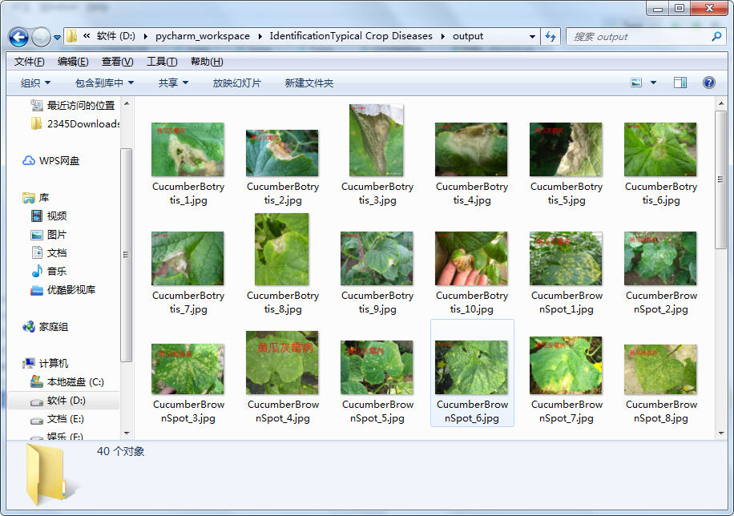
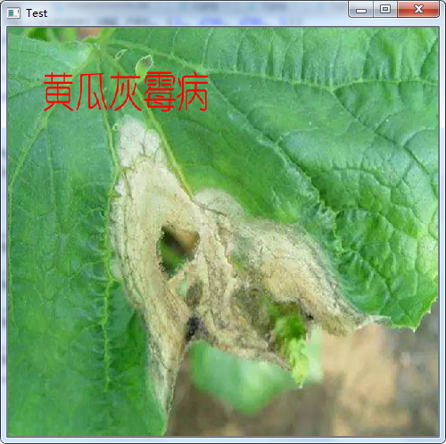

# 农作物病虫害预测

## 实现思路

### 对图像进行中值滤波去噪

1. #### 函数代码

   ```python
   import cv2
   blur_img = cv2.medianBlur(img, 3)
   ```

2. #### 函数原型

   ```python
   def medianBlur(src, ksize, dst=None):
   	pass
   #这个中值滤波函数有三个参数，一般输入src 和 kernel size 注：kernel size一般为奇数 1, 3, 5, 7.....
   ```

   

### 利用k-means算法对图像进行分割

1. #### 分割图像

   ```python
   # 定义中心 (type,max_iter,epsilon)
   # 使用kmeans进行聚类分析，设置终止条件为执行10次迭代或者精确度epsilon=1.0
   criteria = (cv2.TERM_CRITERIA_EPS + cv2.TERM_CRITERIA_MAX_ITER, 10, 1.0)
   
   # 设置标签
   flags = cv2.KMEANS_PP_CENTERS
   
   # K-Means聚类 聚集成K类
   compactness, labels, centers = cv2.kmeans(data_float32, K, None, criteria, 10, flags)
   ```

   

2. #### 整理数据

   ```python
   def extract_data_nyp(path: str):
       path_labels = os.listdir(path)
       data, label = '', ''
       for path_label in path_labels:
           if path_label.endswith('_kmeans'):
               samples = os.listdir(join('dataset', path_label))
               for sample in samples:
                   path = join('dataset/' + path_label, sample)
                   img: ndarray = cv2.imread(path, cv2.IMREAD_GRAYSCALE)
                   img_res = cv2.resize(img, (256, 256))
                   x = np.reshape(img_res, (1, 256, 256, 1))
                   if isinstance(data, ndarray):
                       data = np.vstack((x, data))
                       label = np.vstack((utils.to_categorical(LABELINT[path_label[:-7]], 4), label))
   
                   else:
                       data = x
                       label = np.reshape(utils.to_categorical(LABELINT[path_label[:-7]], 4), (1, 4))
   
                   print(data.shape, label.shape)
   
       np.save('data/data.npy', data)
       np.save('data/label.npy', label)
   ```

   **将图像数据统一整理成shape (1,256,256,1) 的numpy数据**

### 训练卷积神经网络对分割后的图像进行特征提取

1. #### 模型结构

   ```python
   import warnings
   
   warnings.filterwarnings('ignore')
   
   from keras.models import Sequential
   from keras.layers.convolutional import Conv2D, MaxPooling2D
   from keras.layers.core import Flatten, Dense, Dropout, Activation
   from keras import backend as K
   
   
   class AlexNet:
       @staticmethod
       def build(width, height, depth, classes):
           # initialize the model
           model = Sequential()
           inputShape = (height, width, depth)
           # if we are using "channels last", update the input shape
           if K.image_data_format() == "channels_first":  # for tensorflow
               inputShape = (depth, height, width)
           model.add(
               Conv2D(20, (5, 5), input_shape=inputShape, padding='same', activation='relu', kernel_initializer='uniform'))
           model.add(MaxPooling2D(pool_size=(2, 2), strides=(2, 2)))
           model.add(Conv2D(40, (5, 5), strides=(1, 1), padding='same', activation='relu', kernel_initializer='uniform'))
           model.add(MaxPooling2D(pool_size=(2, 2), strides=(2, 2)))
           model.add(Conv2D(80, (3, 3), strides=(1, 1), padding='same', activation='relu', kernel_initializer='uniform'))
           model.add(Conv2D(80, (3, 3), strides=(1, 1), padding='same', activation='relu', kernel_initializer='uniform'))
           model.add(Conv2D(40, (3, 3), strides=(1, 1), padding='same', activation='relu', kernel_initializer='uniform'))
           model.add(MaxPooling2D(pool_size=(2, 2), strides=(2, 2)))
           model.add(Flatten())
           # model.add(Dense(4096, activation='relu'))
           model.add(Dense(512, activation='relu'))
           model.add(Dropout(0.5))
           # model.add(Dense(4096, activation='relu'))
           model.add(Dense(512, activation='relu'))
           model.add(Dropout(0.5))
           # softmax classifier
           # model.add(Dense(1000, activation='softmax'))
           model.add(Dense(classes))
           model.add(Activation("softmax"))
   
           model.summary()
           # Save a PNG of the Model Build
           # plot_model(model, to_file='imgs/AlexNet.png')
           # return the constructed network architecture
           return model
   ```

   

2. #### 加载数据进行训练

   - 读取整理好的numpy数据

     ```
     x = np.load('data/data.npy')
     y = np.load('data/label.npy')
     ```

     

   - 喂入网络进行训练

     ```python
     from keras import Sequential
     from keras.optimizers import SGD
     import numpy as np
     
     from model.alexnet import AlexNet
     
     model: Sequential = AlexNet().build(256, 256, 1, 4)
     
     model.compile(loss="categorical_crossentropy", optimizer=SGD(lr=0.01),
                   metrics=["accuracy"])
     
     x = np.load('data/data.npy')
     y = np.load('data/label.npy')
     print(x.shape,y.shape)
     model.fit(x, y, batch_size=40, epochs=100, verbose=1, shuffle=True)
     model.save('alexnet_model.h5')
     ```

### 利用训练好的卷积神经网络模型进行特征提取

1. #### 加载网络和numpy数据，提取特征

   ```python
   model: Sequential = load_model('alexnet_model.h5')
   model.summary()
   dense1_layer_model = Model(inputs=model.input,
   outputs=model.get_layer(index=-3).output)
   x = np.load('data/data.npy')
   y = np.load('data/label.npy')
   x_ = dense1_layer_model.predict(x, batch_size=40, verbose=1)
   np.save('data/feature.npy', x_)
   ```

   

### 利用支持向量机和提取特征进行模型的训练以及预测

1. #### 构建SVM，拟合数据并保存模型

   ```python
   svc: SVC = svm.SVC(kernel='rbf', C=1.2)
   print(np.argmax(y, axis=1))
   print(x_.shape, np.argmax(y, axis=1).shape)
   svc.fit(x_, np.argmax(y, axis=1))
   y_pre = svc.predict(x_)
   print(classification_report(np.argmax(y, axis=1), y_pre))
   print(confusion_matrix(np.argmax(y, axis=1), y_pre))
   print(accuracy_score(np.argmax(y, axis=1), y_pre))
   print('\n精度: {:.4f}'.format(accuracy_score(np.argmax(y, axis=1), y_pre)))
   s = pickle.dumps(svc)
   f = open('svm.model', "wb+")
   f.write(s)
   f.close()
   print("Done\n")
   ```

   

## 训练过程

### 模型训练执行顺序

```python
# 对图像进行中值滤波和k-means图像分割
k_means_segement('dataset') 

# 将图像数据抽取成numpy数据保存
extract_data_nyp('dataset')

# 将保存的numpy数据喂入网络，训练alexnet网络
train_alexnet()

# 利用训练好的卷积神经网络模型进行特征提取，并喂入svm模型中进行训练
alexnet_cnn_svm()
```


### 效果展示

```python
# 加载所有的网络模型
load_svm_cnn_model()

# 这是一个预测展示函数，对dataset文件夹下面所有的图像进行预测，保存在文件夹output,并且显示图像
output('dataset')
```



