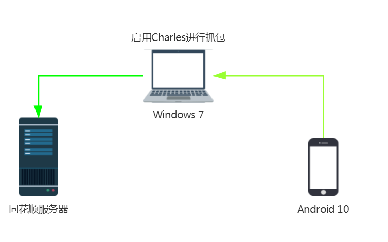
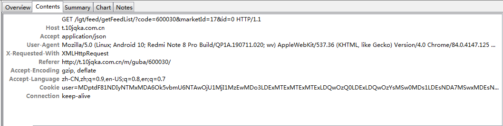
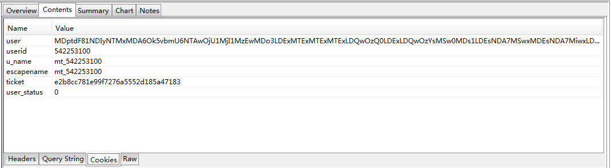
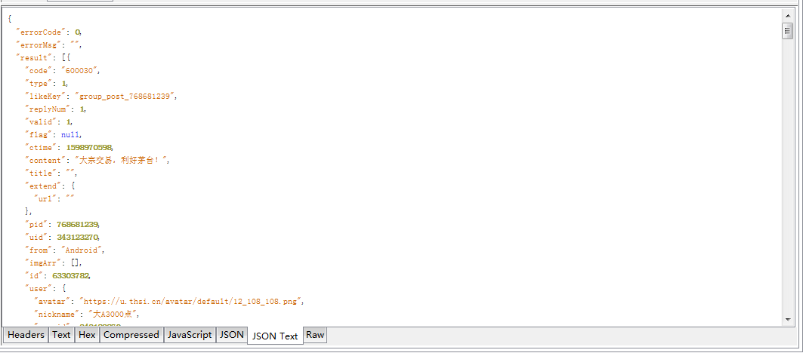
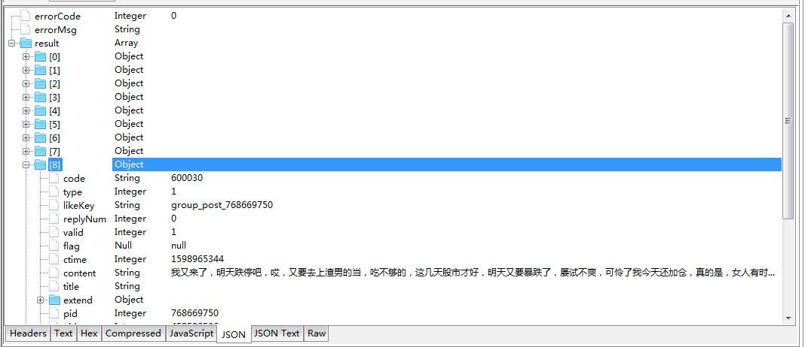

# 竞品同花顺论股接口抓取

- **使用工具与设备**

  1. Windows 7 系统

  2. Redmi Note 8 Pro （Android 10）

  3. Charles （4.2.7）

- **网络拓扑**

  
  
- **Charles配置**
  
  具体配置可参考 https://www.cnblogs.com/dddcsry/p/12929171.html
  
  
  
- **HTTP请求数据格式**

  ```shell
  请求头信息
  
  GET /lgt/feed/getFeedList/?code=600030&marketId=17&id=0 HTTP/1.1
  Host: t.10jqka.com.cn
  Accept: application/json
  User-Agent: Mozilla/5.0 (Linux; Android 10; Redmi Note 8 Pro Build/QP1A.190711.020; wv) AppleWebKit/537.36 (KHTML, like Gecko) Version/4.0 Chrome/84.0.4147.125 Mobile Safari/537.36 Hexin_Gphone/9.53.03 (Royal Flush) hxtheme/1 innerversion/G037.08.276.1.32 userid/-542253100
  X-Requested-With: XMLHttpRequest
  Referer: http://t.10jqka.com.cn/m/guba/600030/
  Accept-Encoding: gzip, deflate
  Accept-Language: zh-CN,zh;q=0.9,en-US;q=0.8,en;q=0.7
  Cookie: user=MDptdF81NDIyNTMxMDA6Ok5vbmU6NTAwOjU1MjI1MzEwMDo3LDExMTExMTExMTExLDQwOzQ0LDExLDQwOzYsMSw0MDs1LDEsNDA7MSwxMDEsNDA7MiwxLDQwOzMsMSw0MDs1LDEsNDA7OCwwMDAwMDAwMDAwMDAwMDAwMDAwMDAwMSw0MDsxMDIsMSw0MDo6Ojo1NDIyNTMxMDA6MTU5ODk3NTU4MDo6OjE1OTg5NDQwMjA6MjY3ODQwMDowOjFlY2MxOTNiMmRjMWZlN2M4MzQ1MWNmNDhhZjIwYWJiNTo6MA%3D%3D; userid=542253100; u_name=mt_542253100; escapename=mt_542253100; ticket=e2b8cc781e99f7276a5552d185a47183; user_status=0
  Connection: keep-alive
  ```

  

  1. **Request Content**

     

     

  2. **Response Content**

     

     


https://d.10jqka.com.cn/market/hs/codes.json

https://upass.10jqka.com.cn/login?platform=phone&view=public&detail=6&source=sns&showRemember=true&redir=https%3A%2F%2Ft.10jqka.com.cn%2Fm%2Fuser%2Findex%2F%3Fuserid%3D486454952