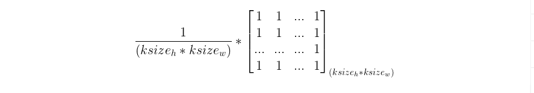

# 基于Flask-Keras-Mnist的对抗图片判断


## web前端

1. ### 工具框架
   - #### Flask框架

     ​		Flask诞生于2010年，是Armin ronacher（人名）用 Python 语言基于 Werkzeug 工具箱编写的轻量级Web开发框架。
     　　Flask 本身相当于一个内核，其他几乎所有的功能都要用到扩展（邮件扩展Flask-Mail，用户认证Flask-Login，数据库Flask-SQLAlchemy），都需要用第三方的扩展来实现。比如可以用 Flask 扩展加入ORM、窗体验证工具，文件上传、身份验证等。Flask 没有默认使用的数据库，你可以选择 MySQL，也可以用 NoSQL。其 WSGI 工具箱采用 Werkzeug（路由模块），模板引擎则使用 Jinja2。这两个也是 Flask 框架的核心。

     

   - #### JinJa2模板引擎

     ​		Jinja2 是一个现代的，设计者友好的，仿照 Django 模板的 Python 模板语言。 它速度快，被广泛使用，并且提供了可选的沙箱模板执行环境保证安全:

     ```html
     <title></title>
     <ul>
     
       <li><a href="{{ user.url }}">{{ user.username }}</a></li>
     
     </ul>
     ```

     **特性:**

     - 沙箱中执行
     - 强大的 HTML 自动转义系统保护系统免受 XSS
     - 模板继承
     - 及时编译最优的 python 代码
     - 可选提前编译模板的时间
     - 易于调试。异常的行数直接指向模板中的对应行。
     - 可配置的语法


## 后端处理

1. ### 工具框架

   - #### Keras深度学习框架

     Keras是一个高层神经网络API，Keras由纯Python编写而成并基[Tensorflow](https://github.com/tensorflow/tensorflow)、[Theano](https://github.com/Theano/Theano)以及[CNTK](https://github.com/Microsoft/cntk)后端。Keras 为支持快速实验而生，能够把你的idea迅速转换为结果，如果你有如下需求，请选择Keras：

     - 简易和快速的原型设计（keras具有高度模块化，极简，和可扩充特性）
     - 支持CNN和RNN，或二者的结合
     - 无缝CPU和GPU切换

     

     Keras适用的Python版本是：Python 2.7-3.6

     Keras的设计原则是

     - 用户友好：Keras是为人类而不是天顶星人设计的API。用户的使用体验始终是我们考虑的首要和中心内容。Keras遵循减少认知困难的最佳实践：Keras提供一致而简洁的API， 能够极大减少一般应用下用户的工作量，同时，Keras提供清晰和具有实践意义的bug反馈。

     - 模块性：模型可理解为一个层的序列或数据的运算图，完全可配置的模块可以用最少的代价自由组合在一起。具体而言，网络层、损失函数、优化器、初始化策略、激活函数、正则化方法都是独立的模块，你可以使用它们来构建自己的模型。

     - 易扩展性：添加新模块超级容易，只需要仿照现有的模块编写新的类或函数即可。创建新模块的便利性使得Keras更适合于先进的研究工作。

     - 与Python协作：Keras没有单独的模型配置文件类型（作为对比，caffe有），模型由python代码描述，使其更紧凑和更易debug，并提供了扩展的便利性。

       

   - #### Numpy数据并行计算框架

     NumPy是使用Python进行科学计算的基础软件包。除其他外，它包括：

     - 功能强大的N维数组对象。

     - 精密广播功能函数。

     - 集成 C/C+和Fortran 代码的工具。

     - 强大的线性代数、傅立叶变换和随机数功能。

       

   - #### Opencv计算机视觉库

     总的一句话，opencv是一个强大的图像处理和计算机视觉库，实现了很多实用算法。

     

2. ### 数据集

   - #### Mnist数据集

     MNIST数据集(**Mixed National Institute of Standards and Technology database**)是美国国家标准与技术研究院收集整理的大型手写数字数据库,包含60,000个示例的训练集以及10,000个示例的测试集。

3. ### 算法模型

   - #### 均值模糊（Mean-Blur）

     **均值模糊，也称为均值滤波，相当于卷积核的矩阵值全部为1/(卷积SIZE)，如下图所示：**

     **cv2.blur**

     - **原型：blur(src, ksize, dst=None, anchor=None, borderType=None)**

     - **作用：对图像进行算术平均值模糊**

     - **参数：ksize：卷积核的大小。dst，若填入dst，则将图像写入到dst矩阵。borderType：填充方式**

     **假设我们传入的，那么均值模糊的卷积核就是：**

     

   - #### 自编码器（Auto-Encoder)

     ​		自编码器是一个输入和学习目标相同的神经网络，其结构分为编码器和解码器两部分。给定输入空间和特征空间，自编码器求解两者的[映射](https://baike.baidu.com/item/映射/20402621)使输入特征的重建误差达成最小 ：

     

     求解完成后，由编码器输出的隐含层特征，即“编码特征（encoded feature）”可视为输入数据的表征。按自编码器的不同，其编码特征可以是输入数据的压缩（收缩自编码器）、稀疏化（稀疏自编码器）或隐变量模型（变分自编码器）等 。

   - #### 卷积神经网络（Convolutional Neural Network）

     卷积神经网络（Convolutional Neural Networks, CNN）是一类包含[卷积](https://baike.baidu.com/item/卷积/9411006)计算且具有深度结构的[前馈神经网络](https://baike.baidu.com/item/前馈神经网络/7580523)（Feedforward Neural Networks），是[深度学习](https://baike.baidu.com/item/深度学习/3729729)（deep learning）的代表算法之一  。卷积神经网络具有[表征学习](https://baike.baidu.com/item/表征学习/2140515)（representation learning）能力，能够按其阶层结构对输入信息进行平移不变分类（shift-invariant classification），因此也被称为“平移不变人工神经网络（Shift-Invariant Artificial Neural Networks, SIANN）” 。

     对卷积神经网络的研究始于二十世纪80至90年代，时间延迟网络和LeNet-5是最早出现的卷积神经网络；在二十一世纪后，随着深度学习理论的提出和数值计算设备的改进，卷积神经网络得到了快速发展，并被应用于[计算机视觉](https://baike.baidu.com/item/计算机视觉/2803351)、[自然语言处理](https://baike.baidu.com/item/自然语言处理/365730)等领域  。

     卷积神经网络仿造生物的视知觉（visual perception）机制构建，可以进行[监督学习](https://baike.baidu.com/item/监督学习/9820109)和[非监督学习](https://baike.baidu.com/item/非监督学习/16588789)，其隐含层内的卷积核参数共享和层间连接的稀疏性使得卷积神经网络能够以较小的计算量对格点化（grid-like topology）特征，例如像素和音频进行学习、有稳定的效果且对数据没有额外的特征工程（feature engineering）要求。

     

     AlexNet是在LeNet的基础上加深了网络的结构，学习更丰富更高维的图像特征。AlexNet的特点：

     - 更深的网络结构

     - 使用层叠的卷积层，即卷积层+卷积层+池化层来提取图像的特征

     - 使用Dropout抑制过拟合

     - 使用数据增强Data Augmentation抑制过拟合

     - 使用Relu替换之前的sigmoid的作为激活函数

     - 多GPU训练

       

     ReLu作为激活函数

      在最初的感知机模型中，输入和输出的关系如下：


​				只是单纯的线性关系，这样的网络结构有很大的局限性：即使用很多这样结构的网络层叠加，其输出和				输入仍然是线性关系，无法处理有非线性关系的输入输出。因此，对每个神经元的输出做个非线性的转				换也就是，将上面就加权求和∑iwixi+b∑iwixi+b的结果输入到一个非线性函数，也就是激活函数中。 这				样，由于激活函数的引入，多个网络层的叠加就不再是单纯的线性变换，而是具有更强的表现能力。

 				

​				在最初，sigmoidsigmoid和tanhtanh函数最常用的激活函数。


4. ### 具体实现

   - #### 数据集下载

     - ###### 下载网址：http://yann.lecun.com/exdb/mnist/

   - #### 数据处理

     - **Ndarray数据**转**图像数据**

       利用Keras自带Mnist数据类自动下载导入数据，使用OpenCV将张量编码成指定格式的图像。

   - #### 模型训练

     - ##### 自编码去噪模型

       1. ###### 模型结构

          ```python
          autoencoder = Sequential()
          
          # Encoder
          autoencoder.add(Conv2D(32, (3, 3), activation='relu', padding='same', input_shape=x_train.shape[1:]))
          autoencoder.add(MaxPooling2D((2, 2), padding='same'))
          autoencoder.add(Conv2D(32, (3, 3), activation='relu', padding='same'))
          autoencoder.add(MaxPooling2D((2, 2), padding='same'))
          
          # Decoder
          autoencoder.add(Conv2D(32, (3, 3), activation='relu', padding='same'))
          autoencoder.add(UpSampling2D((2, 2)))
          autoencoder.add(Conv2D(32, (3, 3), activation='relu', padding='same'))
          autoencoder.add(UpSampling2D((2, 2)))
          autoencoder.add(Conv2D(1, (3, 3), activation='sigmoid', padding='same'))
          
          autoencoder.summary()
          ```

          

       2. ###### 模型的输入与输出

          ```python
          input_shape = (None,28,28,depth)
          output_shape = (None,28,28,depth)
          ```

          

     - ##### AlexNet卷积神经网络模型

       1. ###### 模型结构

          ```python
                  model = Sequential()
                  inputShape = (height, width, depth)
                  # if we are using "channels last", update the input shape
                  if K.image_data_format() == "channels_first":  # for tensorflow
                      inputShape = (depth, height, width)
                  model.add(
                      Conv2D(20, (5, 5), input_shape=inputShape, padding='same', activation='relu', kernel_initializer='uniform'))
                  model.add(MaxPooling2D(pool_size=(2, 2), strides=(2, 2)))
                  model.add(Conv2D(40, (5, 5), strides=(1, 1), padding='same', activation='relu', kernel_initializer='uniform'))
                  model.add(MaxPooling2D(pool_size=(2, 2), strides=(2, 2)))
                  model.add(Conv2D(80, (3, 3), strides=(1, 1), padding='same', activation='relu', kernel_initializer='uniform'))
                  model.add(Conv2D(80, (3, 3), strides=(1, 1), padding='same', activation='relu', kernel_initializer='uniform'))
                  model.add(Conv2D(40, (3, 3), strides=(1, 1), padding='same', activation='relu', kernel_initializer='uniform'))
                  model.add(MaxPooling2D(pool_size=(2, 2), strides=(2, 2)))
                  model.add(Flatten())
                  model.add(Dense(4096, activation='relu'))
                  model.add(Dropout(0.5))
                  model.add(Dense(4096, activation='relu'))
                  model.add(Dropout(0.5))
                  # softmax classifier
                  # model.add(Dense(1000, activation='softmax'))
                  model.add(Dense(classes))
                  model.add(Activation("softmax"))
          
                  model.summary()
          ```

          

       2. ###### 模型的输入与输出

          ```python
          input_shape = (None,28,28,depth)
          output_shape = (None,classes)
          ```

          

   - #### 部署上线

     - 将自编码模型与卷积神经网络模型初始化加载进内存，并且初始化计算图。
     - 初始化Flask框架的路由功能。
     - 前端上传图像数据，后端接收数据对原始图像进行均值滤波操作和自编码器去噪，分别喂入卷积神经网络模型，获取模型推理结果按照计算规则，与初始阈值进行比较计算，最终判断图片是否为对抗图像。


