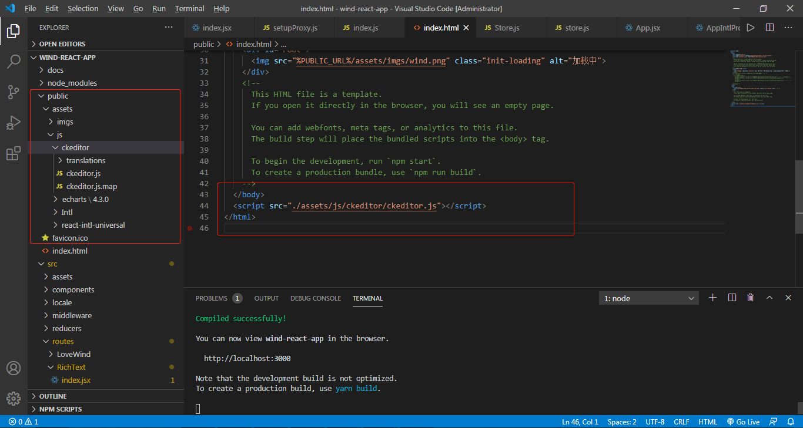
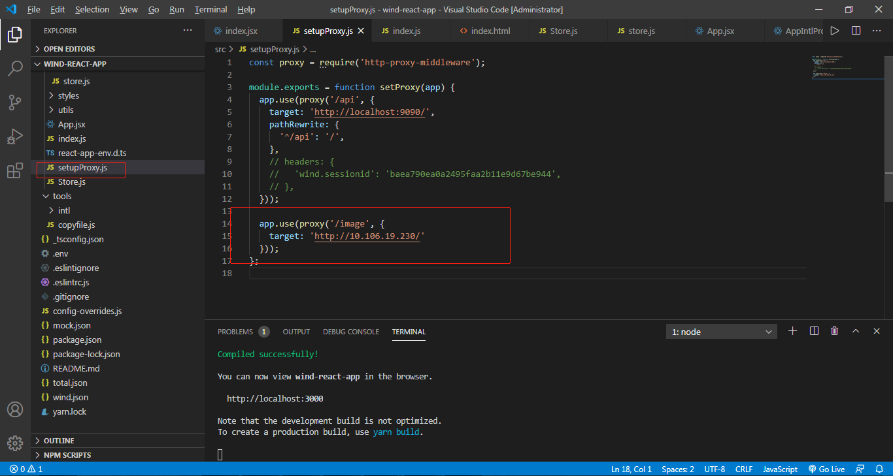

# ckeditor 配置

1. 导入编译好的ckeditor.js插件，并导入

   

2. 编写测试代码

   ```jsx
   import React, { Component } from 'react';
   // import scriptjs from 'scriptjs';
   
   export default class RichText extends Component {
     constructor(props) {
       super(props);
       this.state = {
       };
     }
   
   
     componentDidMount() {
       window.ClassicEditor.create(document.querySelector('#MyTextArea'))
         .then((editor) => {
           this.setState({
             editor,
           });
         })
         .catch((error) => {
           console.error(error);
         });
     }
   
     save = () => {
       const { editor } = this.state;
       console.log(editor.getData());
     }
   
     render() {
       return (
         <div className="edtior">
           <textarea id="MyTextArea" cols="200" rows="200" />
           <input type="button" value="保存" onClick={this.save} />
         </div>
       );
     }
   }
   
   ```

   

3. 配置代理

   