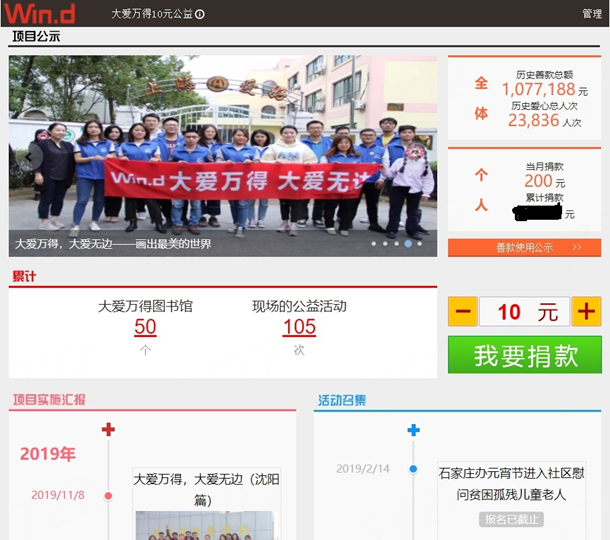
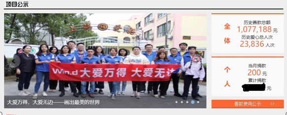
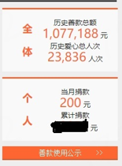
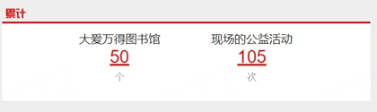
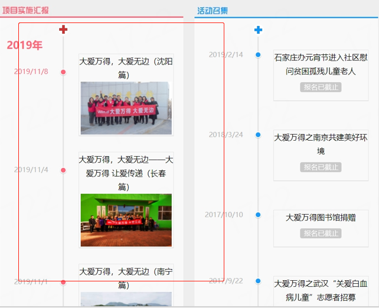

# 大爱万得需求分析

1. **前台展示**

   **大爱万得前台展示相对简单，目前只有一个首页展示和项目详情页展示。**

   

   - **首页展示**

     

     首页展示主要包括项目公示、捐款公示、捐款入口、项目实施汇报、项目详情页信息展示，主要展现我们这个网站做了哪些公益项目，公益项目的执行情况，以及公益项目凝聚的爱心展示，个人感觉页面不宜过度花哨。

     

     - **项目公示**

       

       项目公示主要展示了近期的项目活动，通过轮播图等方式直观的展示给用户。

       

      - **捐款公示**

        

        

        捐款公示主要展示了大爱万得项目总体收到爱心资助和参与度的具体情况
     
        
     
      - **捐款入口**
     
        
     
        捐款入口为用户提供了捐款服务，能够让用户积极的参与公益事业
     
        
     
      - **项目实施汇报**
     
        
     
        项目实施汇报展示了每个公益项目的历程，主要还是展示了历史项目活动
     
        
     
      - **项目详情页**
        
        
        
        当用户点击了项目实施汇报或者项目公示中的某个项目时，跳转到项目详情页进行具体项目的信息展示

2. **捐款服务**

   暂时没有什么想法！不了解具体的业务逻辑，难道是点击一下，输入捐款数字，确认捐款就好了吗？？

3. **后台管理**

   - **项目管理**
- 项目的增删改查（考虑利用分页来展示数据）
     - 富文本编辑器（暂定Ckeditor 5）
     - 文件存储系统（暂定公司提供，后期考虑第三方在线文件系统或者自己搭建FastDFS文件系统）
     
- **上传善款公示**
   - 统计善款信息，提供查找搜索服务(目前考虑后台实名制捐款)
  - 内嵌数据导出（Excel、Word、PDF）
    
   - **项目汇总信息**
- 统计项目信息，提供查找搜索服务
     - 内嵌数据导出（Excel、Word、PDF）
    
   - **数据导出**
   - 对项目信息、善款信息进行导出

