# <center> 锌结合蛋白质结合位点预测 <center>


## 数据集


- 蛋白质相关数据库：

  | 数据库  | 物种    | 描述                                                         |
  | ------- | ------- | ------------------------------------------------------------ |
  | Bind    | Many    | 生物分子相互作用数据库                                       |
  | BioGrid | Many    | 蛋白质-蛋白质以及基因相互作用的数据库                        |
  | DIP     | Many    | 相互作用的蛋白质数据库                                       |
  | HPID    | Human   | 人类蛋白质相互作用数据库                                     |
  | HPRD    | Human   | 人类蛋白质参考数据库                                         |
  | IntAct  | Many    | EBI 的蛋白质相互作用数据库                                   |
  | MINT    | Many    | 分子相互作用数据库                                           |
  | MIPS    | Mammals | 哺乳动物蛋白质相互作用数据库                                 |
  | OPHID   | Human   | 在线预测人类相互作用数据库                                   |
  | STRING  | Many    | 实验和生物信息学方法预测的蛋白质网络数据库                   |
  | PDB     | Many    | 国际上唯一的生物大分子结构数据库，主要包括蛋白质、核酸等实验测定的结构信息 |
  | ProSite | Many    | 收集了生物学有显著意义的蛋白质位点和序列模式，并能快速鉴别蛋白质属于相应的蛋白质家族 |
  
  

- 20 种基本氨基酸

  | 氨基酸   | 三字母 | 单字母 |
  | -------- | ------ | ------ |
  | 丙氨酸   | Ala    | A      |
  | 精氨酸   | Arg    | R      |
  | 天冬氨酸 | Asp    | D      |
  | 半胱氨酸 | Cys    | C      |
  | 谷氨酰胺 | Gln    | Q      |
  | 谷氨酸   | Glu    | E      |
  | 组氨酸   | His    | H      |
  | 异亮氨酸 | Ile    | I      |
  | 甘氨酸   | Gly    | G      |
  | 天冬酰胺 | Asn    | N      |
  | 亮氨酸   | Leu    | L      |
  | 赖氨酸   | Lys    | K      |
  | 甲硫氨酸 | Met    | M      |
  | 苯丙氨酸 | Phe    | F      |
  | 脯氨酸   | Pro    | P      |
  | 丝氨酸   | Ser    | S      |
  | 苏氨酸   | Thr    | T      |
  | 色氨酸   | Trp    | W      |
  | 酪氨酸   | Tyr    | Y      |
  | 缬氨酸   | Val    | V      |

  

- 数据集（具体数据集采用了 [**Zhao_dataset**](http://systbio.cau.edu.cn/ZincExplorer/index.php?page=download)  数据集）:
  - 多特征融合
    
  - 
    
    - 氨基酸的离散型编码
    
      深度学习框架可以以长度为 33 的蛋白质片段作为输入，但原始的蛋白质片段数据是由氨基酸字母表示的类别数据，需要对其进行数值转化才能变成可计算的数据。这里参考普遍用于自然语言处理问题中的编码方式，既 one-of-K 编码。在one-of-K 编码中，K 代表字典的大小，对于氨基酸的编码 K 可以等于 20 代表 20 种常见的氨基酸，每一个氨基酸都用一个维度为 20 的向量表示，只有对应这个氨基酸的位置是 1 其他位置都是 0。然而对于那些蛋白质片段长度不足 33 的，需要用额外的特殊符号
    “-”表示，因此实际的 K=21。对于其他非常见氨基酸或者不确定的氨基酸，例如一般蛋白质数据库中以 X 表示的氨基酸，其编码向量所有位置的值都为 0.05，代表 20 种氨基酸的均匀分布。最终，一个长度为 33 的蛋白质序列片段可以用 33×21 的矩阵表示，其具体的 one-of-21 编码方式如图 下图 所示。接下来的深度学习框架将以该编码方式的蛋白质片段作为输入。 
    
      
    
      
    
    - 蛋白质PSSM 位置特异性得分矩阵
    
      位置特异性打分矩阵（PSSM）由蛋白质序列在数据库中迭代进行多序列比对得到。生物进化理论认为，如果两种生物体是由同一个祖先进化而来，则它们的遗传物质会倾向于具有一定的相似性。也就是说同源物种的遗传物质在整个演化进程中不断地通过局部的序列缺失和重组以及部分碱基的替换等方式进行演变，从而造成了物种之间的显性差异。而多序列比对的方法能够提取出蛋白质序列中所包含的相似性信息，并由此寻找序列中能够决定生物体性状的序列模式。以 Lichtarge 和 Thornton 等人的研究为代表的目前已有的一些结果表明演化信息的重要度评分越高，则该位置的残基是结合位点的可能性越大。因此，使用位置特异性打分矩阵作为预测蛋白质结合位点的特征，具有合理性。
    
      
    
      在蛋白质功能以及蛋白质相互作用预测，蛋白质二级结构预测问题中 PSSM 得分矩阵都是不可或缺的一种特征。并且在前人对于蛋白质-ATP 结合位点预测问题的研究中已经证明了 PSSM 位置特异性得分矩阵对于这个问题的重要性。因此，在本文中，首先第一个提取的特征就是 PSSM 特异性得分矩阵。 [郭丽萍]
      
      
      
       在得到 PSSM 得分矩阵之后，我们对 PSSM 矩阵进行归一化处理从而得到标准化位
      置特异性得分矩阵（LPSSM），目的是让矩阵中的数据更加规范紧凑。并且能够方便后
      续的运算和数据处理。其归一化的公式如下：
      $$
      f(x) = \frac{1}{1 + exp^{-x}}
      $$
      
      
      计算得到的 PSSM 矩阵是一个二维数组，第一维是蛋白质序列中的特定位置，第二维表示 20 种标准氨基酸在蛋白质序列中特定位置出现的可能性.
      
      
    
    
    
    - Bi-gram 特征
    
    - 伪氨基酸组成（PseAAC）特征
    
      用一个20+M维向量表示蛋白质：
      X = [X1,X2,…X20,…,X20+M]
      其中**20维向量表示20种氨基酸残基的出现次数，另外M维向量表示蛋白质的近似熵、亲水疏水信息等特征**。
    
      PseAA是在AAc的基础上，加入了一些能够表示残基之间顺序信息的特征。
    
      
    
    - 氨基酸组分(AAC) 特征 
    
      用一个20维向量表示蛋白质：
      X = [X1,X2,…X20]
      其中**Xi表示第i种氨基酸在序列P中出现的次数**。
       该方法提取的特征只能反映20种基本氨基酸的出现频率，丢失了各个残基之间的排列顺序信息。
    
      AAC仅仅描述了蛋白质序列中各氨基酸的含量百分比，丢失了各残基之间的顺序信息。
    
      
    
    - 蛋白质二级结构
    
      ​		蛋白质的二级结构特征主要反映的是局部空间构象，这种构象是重复的且有规则的。蛋白质序列主链原子的三维空间排列就是蛋白质的空间构象，这种排布在一定程度上可以决定蛋白质的功能作用。由于蛋白质序列上的各个氨基酸连接起来的肽链的不断运动，使得蛋白质链的构象有很多，这就形成了蛋白质的二级结构，包括：α-螺旋，β-转角以及β-折叠和无规卷曲。
    
      蛋白质二级结构中，α-螺旋，β-折叠，分别用H和E来描述，其余的无规则卷曲部分用C来描述。这样，一个蛋白质二级结构序列由3个抽象字符构成[百度文库]。
    
      蛋白质主要二级结构 蛋白质二级结构是氨基 酸残基在蛋白质多肽链中的局部空间构象，其具有 8 种类型， 分别是 α-螺旋（H）、β-桥（B）、折叠（E）、螺旋-3（G）、 螺旋-5（I）、转角（T）、卷曲（S）和环（L）。 把八类二级结构粗略地归类为螺旋、折叠和卷曲三类。
    
      
    
      ​		二级结构的数据形式与 PSSM 得分矩阵相同，我们需要将蛋白质的序列文件提交给
      软件作为输入，之后就会返回一个包含蛋白质二级结构的文件，这个文件内容如下图所示。
    
      https://wenku.baidu.com/view/eb747eb54531b90d6c85ec3a87c24028905f8542.html
    
      
    
      蛋白质特征序列的频率描述
    
      蛋白质特征序列中H、C、E出现频率：
      $$
      p_{i} = \frac{f_{i}}{n}
      $$
      其中fi为在蛋白质序列中出现的个数，n为序列的长度，i = E,C,H
    
      
    
      
    
      
    
    - 蛋白质理化属性
    
      1.疏水性指数（Hydrophobicity index） 
      2.平均极性（Mean polarity） 
      3.正电荷（Positive charge） 
      4.负电荷（Negative charge） 
      5.溶剂可及表面积（Accessible surface area） 
    
      
    
    - 滑动窗口技术（一般是由经验值给出，后期通过算法进行优化对比）
    
      
    
  - 数据问题
    
    - 正负样本数据不平衡问题（可以尝试SOMTE过采样避免数据不平衡问题）
    
      ​		类别不平衡问题，顾名思义，即数据集中存在某一类样本，其数量远多于或远少于其他类样本，从而导致一些机器学习模型失效的问题。例如逻辑回归即不适合处理类别不平衡问题，例如逻辑回归在欺诈检测问题中，因为绝大多数样本都为正常样本，欺诈样本很少，逻辑回归算法会倾向于把大多数样本判定为正常样本，这样能达到很高的准确率，但是达不到很高的召回率。
    
      ​    	类别不平衡问题在很多场景中存在，例如欺诈检测，风控识别，在这些样本中，黑样本（一般为存在问题的样本）的数量一般远少于白样本（正常样本）。
    
      ​    	上采样(过采样)和下采样(负采样）策略是解决类别不平衡问题的基本方法之一。上采样即增加少数类样本的数量，下采样即减少多数类样本以获取相对平衡的数据集。
    
      ​    	最简单的上采样方法可以直接将少数类样本复制几份后添加到样本集中，最简单的下采样则可以直接只取一定百分比的多数类样本作为训练集。
    
      
  
- 结合位点预测

  - 分类问题 （仅仅预测给定的蛋白质序列是否存在结合位点，存在哪些位点）

  - 回归问题（预测蛋白质序列中哪些氨基酸残基是结合位点）


## 算法模型

- 常用机器学习方案（这里主要使用深度学习，当然可以结合其他的机器学习算法辅助）
  - 深度学习经典模型（需要在经典模型的基础上进行改进，比如说引入Attention机制等等）
    1. 卷积神经网络
    2. 长短期记忆网络
    3. 残差网络
    4. 胶囊网络


## 相关知识


- **锌结合位点定义**

  ​		锌离子结合位点定义为蛋白质的残基，该残基中的任意一个氮原子、氧原子或者硫原子
  与锌离子距离在 3.0 Å以内。常结合的氨基酸残基有半胱氨酸（CYS）、组氨酸（HIS）、天冬
  氦酸（ASP）、谷氨酸（GLU）、甲硫氨酸（MET)、赖氨酸（LYS)等，其中 CYS（C）、HIS
  （H）、ASP（D）、GLU（E）占所有结合位点的 90%以上，目前国内外的研究以这四类为主。

  ​		在一个蛋白质中，一个锌离子可以同时结合多个氨基酸残基。同时，一个蛋白质可以结
  合多个锌离子。与同一个锌离子相结合的 x（x=1,2,3,4）个残基记为 Znx，结合一个或两个
  氨基酸残基的锌离子（Zn1 和 Zn2）通常位于蛋白质结构的表面，不参加任何化学反应，没
  有实际的生物学意义；结合三个氨基酸残基的锌离子（Zn3）通常作为酶的辅因子，具有催
  化作用；结合四个氨基酸残基的锌离子（Zn4）具有稳定蛋白质结构的作用。

  

- **预测工具的获得**

  1. ZincExplorer
  2. ZincFinder
  3. ZincPred


## 实践中的问题记录

- **问题源自：如何判断一个数据集正负样本是均衡的？**

  ​		PR和ROC在面对不平衡数据时的表现是不同的。**在数据不平衡时，PR曲线是敏感的，随着正负样本比例的变化，PR会发生强烈的变化。而ROC曲线是不敏感的，其曲线能够基本保持不变。**

  ​		**ROC的面对不平衡数据的一致性表明其能够衡量<u>一个模型本身的预测能力**</u>，而这个预测能力是与样本正负比例无关的。但是这个不敏感的特性使得其较难以看出一个模型在面临样本比例变化时模型的预测情况。而PRC因为对样本比例敏感，因此能够看出分类器随着样本比例变化的效果，而实际中的数据又是不平衡的，这样有助于了解分类器实际的效果和作用，也能够以此进行模型的改进。

  ​		综上，在实际学习中，我们可以使用ROC来判断两个分类器的优良，然后进行分类器的选择，然后可以根据PRC表现出来的结果衡量一个分类器面对不平衡数据进行分类时的能力，从而进行模型的改进和优化。

  > real world data经常会面临class imbalance问题，即正负样本比例失衡。根据计算公式可以推知，**在testing set出现**imbalance时ROC曲线能保持不变，而PR则会出现大变化。


- **PRC的相对优势**

  当正负样本差距不大的情况下，ROC和PR的趋势是差不多的，但是当负样本很多的时候，两者就截然不同了，ROC效果依然看似很好，但是PR上反映效果一般。解释起来也简单，假设就1个正例，100个负例，那么基本上TPR可能一直维持在100左右，然后突然降到0。这就说明PR曲线在正负样本比例悬殊较大时更能反映分类的性能。

  >
  > 在正负样本分布得极不均匀(highly skewed datasets)的情况下，PRC比ROC能更有效地反应分类器的好坏。

  

- **序列信息熵**

  ​		蛋白质序列信息熵是一个能够估计序列可变性的保守性评分，它的理论基础是 Shannon 信息论。当给定 fi，即第 i 种氨基酸在序列中的某一位置出现的频 率时，这个位置的序列信息熵可以如下式计算: 
  $$
  Entropy = - \sum_{i=1}^{d}{f_ilnf_i}\tag{1-1}
  $$
  式(1-1)中的 d 是指所有的氨基酸类型的总数。如果所有类型的氨基酸都以相同频 率出现，则：
  $$
  Entropy = -\sum_{i=1}^{n}(1/d)ln(1/d)\tag{1-2}
  $$
  序列信息熵的值代表了一个序列的可变性，当某个序列信息熵（Entropy）的值 等于 0 时，说明这个位置最保守。

   

#### 这个礼拜我做了什么？


1. 实现了蛋白质序列的PSSM矩阵的计算

   计算工具是PSI-Blast  对蛋白质序列进行序列对比

   Python 批量处理 

   - pssm生成
   - pssm简化
   - 标准的pssm构建
   - 滑动pssm生成

   在基于蛋白质序列的相关预測中。使用PSSM打分矩阵会得将预測效果大大提高，同一时候，假设使用滑动的PSSM，效果又会进一步提高。这里主要以分享代码为主，以下介绍下PSSM从生成到处理的全过程。

2. 整体模型的训练 启动

   输入特征简单 结果有点异常 精度太高

   可能原因 输入的特征（氨基酸的离散型编码）比较简单 可能出现了过拟合的问题

   ​				没有负样本 

   

3. 所以我准备扩充数据集特征

   将氨基酸离散编码和PSSM矩阵进行数据特征融合，来观察后面的结果


#### 这个礼拜我做了什么？（3月5日-3月12日）

这个礼拜干的活比较少，主要还是忙于各种笔试和面试。

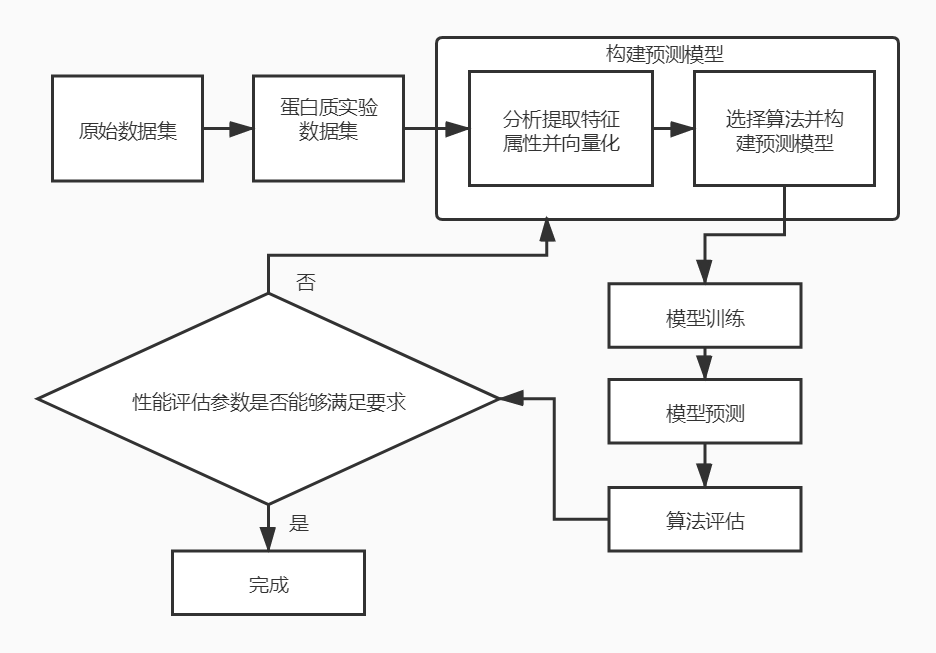

1. 数据集

   - 数据特征融合与丰富（实践与问题）

     实践：氨基酸离散编码+PSSM矩阵 

     问题：1、本来想继续添加蛋白质序列二级结构特征值丰富特征的，但是论文里计算方式和介绍模棱两可，所以蛋白质二级结构特征值的计算目前是卡主了。2、在计算PSSM矩阵过程中，有一些蛋白质序列

     没有计算成功，至少在文件夹下面没有看到对应的PSSM文件。国外看到的网站有一种解释是数据库太小，没有样本序列与之相似。

   - 数据集SMOTE过采样前后的对比，这里为了方便肉眼观察，利用PCA主成分降维成3个维度特征

     为什么会出现这种现象？？？？

     > **进行SMOTE过采样前的数据集空间分布**

     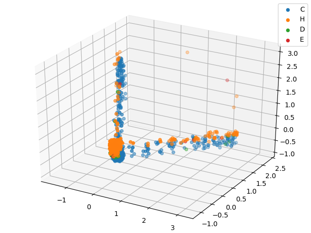

     > **进行SMOTE过采样后的数据集空间分布**

     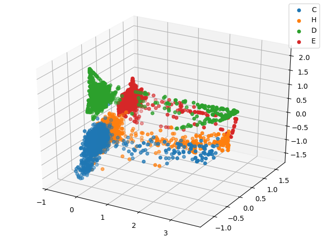

   - 提取负样本，那么说也不准确，因为正负样本一般针对的是二分类问题，所以准确地来说是考虑了不存在的一类问题（目前我是将类别分为5个labels，前4个labels代表蛋白质与金属离子锌的常见结合位点，这些位点在上文相关知识里介绍过，第5类是不存在任何位点）

2. 模型训练与评估

   - 


#### 这个礼拜我做了什么？（3月20日-3月26日）

> 这个礼拜的工作还是在数据集上

- ###### 数据集

  1. 整合了之前的数据处理代码，能够从原始蛋白质数据一步完成数据集的特征提取和合并，包括不同特征的数据集分类。因为之前的代码都是比较零散的脚本，现在进行了集成合并

  2. 提取了key_encoding特征和PSSM特征，进行了训练，具体的训练过程见图

  3. 训练过程中的问题

  4. 接下来继续增加特征，可选的特征如下
     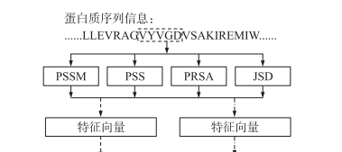

  5. 处理数据不均衡的问题，SMOTE算法看起来效果并不是那么好，大家可以从我的图上看出来

     为啥会不好呢 ？？

     我觉得主要还是SMOTE前的数据集特征分类不够细致，可以看图。SMOTE算法是利用KNN的算法进行插值，前提是你的原始数据集能够有足够的分类能力。所以问题可能还是特征不够丰富

     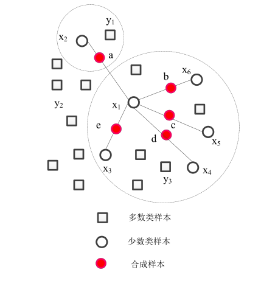

     现在已经采用了PSSM特征，看到很多论文里面将PSSM矩阵进行了归一化操作
     $$
     f(x) = \frac{1}{1 + e^{-x}}
     $$
     

     上个礼拜说到PSS特征不知道如何计算 然后查了几篇论文 终于找到了 是PSIPRED生成的三个特征

     可 以输出 1 个大小为 L×3 的概率矩阵。 二级结构 类型为 Coil(C)、Helix(H)与Strand(E)。 在该矩阵中,1 行都包含 3 个概率值,分别表示对应 氨基酸残基属于上述 3 种二级结构类型的可能 性。与产生每个残基的 PSSM特征一样,1 个大 小为 W 的滑动窗口被用于抽取对应的中心残基 的 PSS 特征。α-螺旋，β-折叠，分别用H和E来描述，其余的无规则卷曲部分用C来描述

  ​       继续增加上面流程图的特征......或者既然减少某类过多的数据其实就是欠采样，过采样是SMOTE算法，这是一个脑洞 不知道有没有效果

  #### 最后我这个礼拜看到有朋友电脑坏了，他也在做毕设，所以数据在电脑里面很麻烦。所以我最近每次干完活了，都很小心的 git push 到 github 私有仓库，做到一个在线备份吧，防止出现意外


#### 这个礼拜我做了什么？（3月27日-4月2日）

1. 获取了蛋白质序列的PSS（predicted secondary structure）数据，二级结构类型为 Coil(C)、Helix(H)与Strand(E)。作为特征向量来说，是三维特征（C,H,E)

   获取方式有两种：

   - 搭建本地的PSIPRED服务器，这个是我目前最大的麻烦。因为需要下载大量的数据库文件，这些文件都很大，然后下载容易失败。
   - 选择提供PSS计算的在线服务。http://bioinf.cs.ucl.ac.uk/psipred/ 这是一个不需要翻墙 不需要付费注册 直接体验上没有检测次数限制的网站。通过手动点击提交后台抓包分析，尝试用爬虫程序实现批量提交检测，并且将检测结果保存到本地。

2. 尝试加入氨基酸残基的溶剂可及性属性（PRSA特征）。目前参考 **基于类不平衡学习的蛋白质与金属离子** 

   **交互位点预测** 这篇论文里的思路，采用SANN的预测方法来计算相对溶剂可及性。SANN可以输出1个大小为L×3 的概率矩阵,在该矩阵中,任意1行都包含3个概率值,分别表示对应氨基酸残基属于 3 种溶剂可及性类 型 Buried ( B )、 Intermediate ( I ) 与Exposed(E)的可能性。作为特征向量来说，是三维特征（B,I,E)

   获取方式（**遇到问题**）：

   - 我通过论文跟踪到了作者前几年提供的在线预测服务，但是很不幸，服务器关闭了。然后我有在主站点查看提供的服务，发现作者留下了SANN的程序包，托管在了github上面，但是......

     以下是作者的README（本以为找到了希望，却发现又是空欢喜一场.........又是需要下载搭建数据库，但是数据库非常大，压缩情况下24GB左右，解压以后可能100GB，**这是一个很大的问题**）

     # SANN:

     A Protein solvent accessibility prediction based on nearest neighbor method

     ## Pre-requisite:

     ```powershell
     - Python, numpy
     - Psi-blast (blastpgp 2.2.23 [Feb-03-2010])
     - uniref90 sequence databse filtered
     ```

     ## Installation:

     *Download SANN package and build

     ```shell
       $ tar xvzf sann.tar.gz
       $ cd sann/src
       $ make
       $ make install
     ```

     *Download database

     ```Java
       nndb: http://lee.kias.re.kr/insilico/data/nndb.tar.gz
       seqdb: http://lee.kias.re.kr/insilico/data/seqdb.tar.gz
     ```

     *Set environment variable in your shell (ex: .bashrc)

     ```shell
       export NNDB_HOME=$HOME/database/nndb
       export SANN_HOME=$HOME/sann
       export PATH=$PATH:$SANN_HOME/bin
     ```

     *Edit NCBIDIR and nr90 variable in the script “sann.sh”

     ## Update History:

     - Current 2016-02-01
     - First release 2015-01-21

     ## Run a example

     input file: test.fa (a protein sequence in fasta format)

     ```
        $ cd example
        $ sann.sh test
     ```

     ## References

     [1] Keehyoung Joo, Sung Jong Lee and Jooyoung Lee, Sann: Solvent accessibility prediction of proteins by nearest neighbor method, PROTEINS-STRUCTURE FUNCTION AND BIOINFORMATICS, 80, 1791-1797 (2012)
     
     


#### 这个礼拜我做了什么？（4月3日-4月9日）

这个礼拜围绕手上已经采集到的蛋白质特征，做了一些数据处理。面临的主要问题：小样本+分布不均衡，在网络层数较深的情况下，预测结果会偏向样本数量较多的类别

比如在预测微博互动数的问题中，虽然数据不平衡，但每个档位的数据量都很大——最少的类别也有几万个样本，这样的问题通常比较容易解决；而在癌症诊断的场景中，因为患癌症的人本来就很少，所以数据不但不平衡，样本数还非常少，这样的问题就非常棘手。综上，可以把问题根据难度从小到大排个序：**大数据+分布均衡**<**大数据+分布不均衡**<**小数据+数据均衡**<**小数据+数据不均衡**。

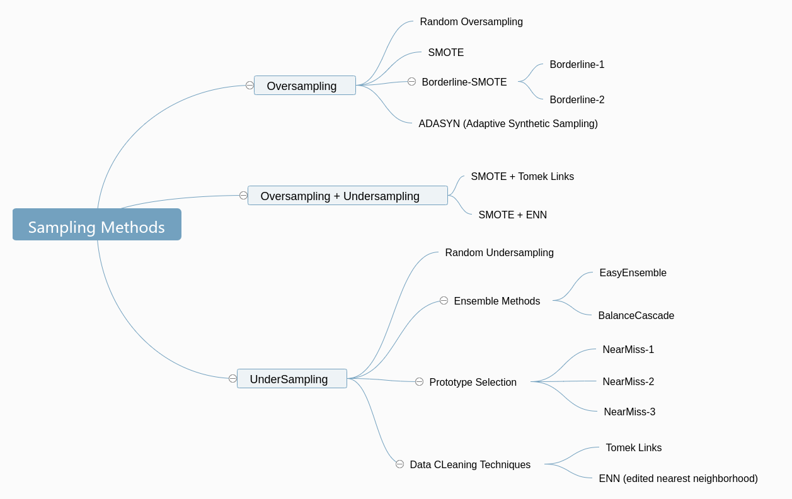

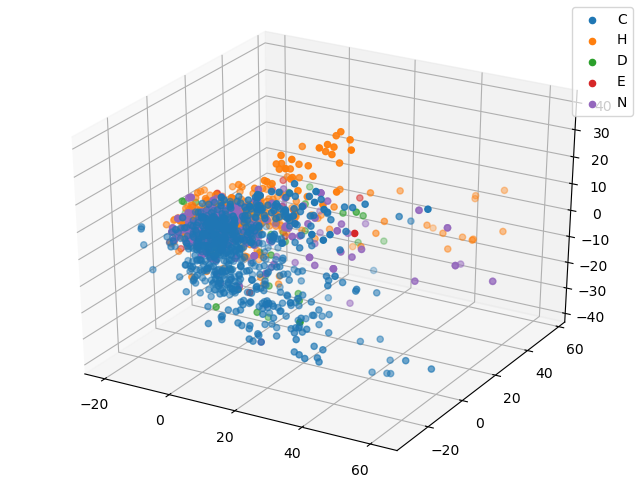

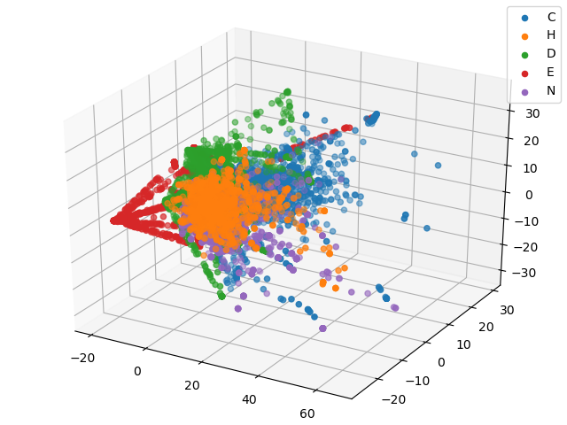

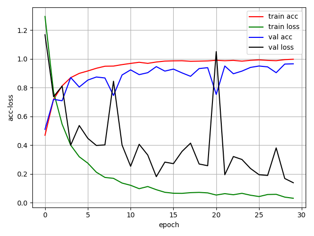

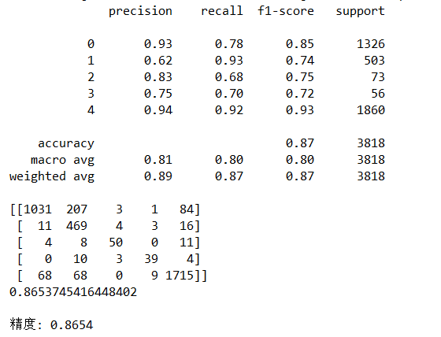

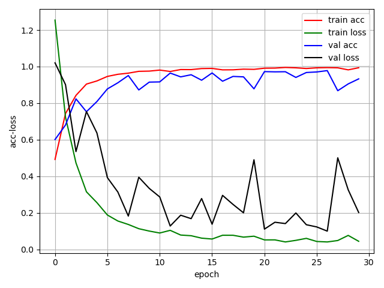

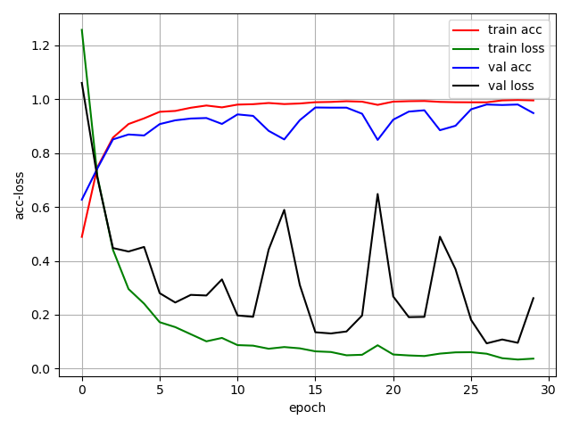

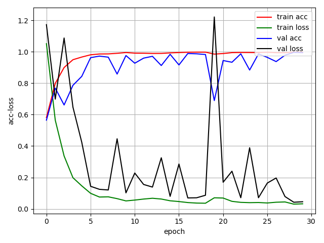

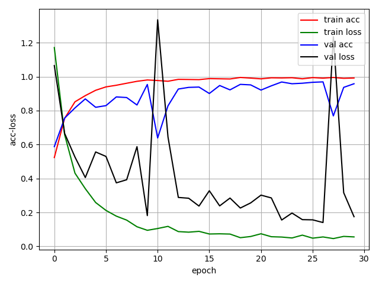

1. ##### 基于Densnet加入Attention机制模型（数据集key_pssm_pss来源于以上增强）


| Depth | Epoch | Train_acc          | Test_acc           |
| ----- | ----- | ------------------ | ------------------ |
| 7     | 30    | 0.9235201676270298 | 0.7525279403938265 |
| 10    | 30    | 0.9083289680460974 | 0.785524215007983  |
| 13    | 30    | 0.9515453116815087 | 0.8270356572645023 |
| 16    | 30    | 0.8999476165531692 | 0.7323044172432145 |

2. ##### 基于Densnet加入Attention机制模型（原始数据集key_pssm_pss）


| Depth | Epoch | Train_acc          | Test_acc           |
| ----- | ----- | ------------------ | ------------------ |
| 7     | 30    | 0.9722367731796753 | 0.7184672698243747 |
| 10    | 30    | 0.9539025667888947 | 0.6609898882384246 |
| 13    | 30    | 0.9853326348873755 | 0.8259712613092071 |
| 16    | 30    | 0.963069669984285  | 0.6785524215007983 |

3. ##### 基于Densnet加入Attention机制模型（数据集key_pssm来源于以上增强）

| Depth | Epoch | Train_acc          | Test_acc           |
| ----- | ----- | ------------------ | ------------------ |
| 7     | 30    | 0.9455212152959664 | 0.805747738158595  |
| 10    | 30    | 0.9083289680460974 | 0.6407663650878127 |
| 13    | 30    | 0.9421162912519644 | 0.817456093666844  |
| 16    | 30    | 0.9408067050811943 | 0.7243214475784993 |

4. ##### 基于Densnet加入Attention机制模型（原始数据集key_pssm）

| Depth | Epoch | Train_acc          | Test_acc           |
| ----- | ----- | ------------------ | ------------------ |
| 7     | 30    | 0.9850707176532216 | 0.7663650878126663 |
| 10    | 30    | 0.9460450497642745 | 0.5444385311335816 |
| 13    | 30    | 0.9806181246726035 | 0.738158594997339  |
| 16    | 30    | 0.9588789942378209 | 0.651942522618414  |

##### 分析结论：

1. 通过观察1、2或者3、4两组实验结果来看，train_acc和test_acc的差距在缩小，数据含义就是训练集的特征分布更接近测试集的特征分布了。注意这里使用的训练集是通过数据增强的，而测试集数据就是原始的特征堆积，这说明对训练集的采样处理既解决了样本数据分布不均匀问题但又没有引入样本类别重叠的问题。在原始小样本+不平衡的样本场景下，通过对样本数量多的类别进行欠采样、样本数量少的类别进行过采样，使得处理后的数据尽可能均衡且样本分布空间与原数据集差别不大。
2. 通过观察1、3或者2、4两组实验结果来看，通过扩充蛋白质序列的数据特征，使得特征数据的表达能力更加丰富，氨基酸的离散型编码、位置特异性得分矩阵和蛋白质二级结构数据是有效的特征。随着数据特征的丰富，测试集的精度也越来越高。
3. 这里其实只是单纯的看了precision这一个指标，比较全面的评估一个模型还需要观察它的其他指标，比如说recall、f1-score、accuracy等。

#### 这个礼拜我做了什么？（4月9日-4月16日）

1. 利用SVM算法对已经处理好的特征数据进行分类预测
   | **kernel** | **class_weight** | **C** | **acc**            |
   | ---------- | ---------------- | ----- | ------------------ |
   | linear     | balanced         | 0.8   | 0.8270356572645023 |
   | rbf        | balanced         | 0.8   | 0.8797232570516232 |
   | poly       | balanced         | 0.8   | 0.8414050026609899 |

   | **kernel** | **class_weight** | **C** | **acc**            |
   | ---------- | ---------------- | ----- | ------------------ |
   | rbf        | balanced         | 0.8   | 0.8797232570516232 |
   | rbf        | balanced         | 1.0   | 0.8797232570516232 |
   | rbf        | balanced         | 1.2   | 0.8807876530069185 |
   | rbf        | balanced         | 1.4   | 0.8802554550292709 |
   | rbf        | balanced         | 1.6   | 0.8797232570516232 |
   
   | **kernel** | **class_weight** | **C** | **acc**            |
   | ---------- | ---------------- | ----- | ------------------ |
   | rbf        | balanced         | 1.2   | 0.8807876530069185 |
   | rbf        | 1:1:1:......     | 1.2   | 0.8845130388504524 |
   
   

1. 利用springboot构建了一个简易的前端页面，利用flask构建api接口，提供低并发的预测服务......

3. 耗时任务，异步处理，结果发送邮件

3. 负样本处理得有些问题，好在问题已经定位到了。下一个版本就可以解决。


#### 这个礼拜我做了什么？（4月16日-4月23日）

1. HMM模型
- HMM有三类典型问题：
     - 解码问题：已知模型参数和X，估计最可能的Z； 维特比算法
     - 概率问题：已知模型参数和X，估计X出现的概率； 向前-向后算法
     - 学习问题：仅给出X，估计模型参数。 B-W算法
   - hmmlearn对于概率生成分布有三种，分别是：
     - 高斯分布：hmm.GaussianHMM
     - 混合高斯分布：hmmGMHMM
     - 离散分布：hmmMultinomialHMm（仅用于离散观测状态）
2. 修正了训练数据以及前期的错误，精度得到了提升。svm的精度在0.9203，densenet精度在0.9007。
3. 想用CNN + SVM尝试下，CNN提取向量特征，SVM做分类


#### 这个礼拜我做了什么？（4月23日-4月30日）

1. HMM模型(没有能够应用到蛋白质结合位点的预测)

- HMM有三类典型问题：

  - 解码问题：已知模型参数和X，估计最可能的Z； 维特比算法。即给定模型λ=(A,B,π)λ=(A,B,π)和观测序列OO，计算在模型λλ下观测序列出现的最大概率P(O|λ)P(O|λ)；

  - 概率问题：已知模型参数和X，估计X出现的概率； 向前-向后算法。即给定模型λ=(A,B,π)λ=(A,B,π)和观测序列OO，计算在模型λλ下观测序列出现的最大概率P(O|λ)P(O|λ)；

  - 学习问题：仅给出X，估计模型参数。 B-W算法。即给定观测序列OO，估计模型的参数λλ, 使得在该参数下观测序列出现的概率最大，即P(O|λ)P(O|λ)最大；

  - hmmlearn对于概率生成分布有三种，分别是：

    - 高斯分布：hmm.GaussianHMM

    - 混合高斯分布：hmmGMHMM

    - 离散分布：hmmMultinomialHMm（仅用于离散观测状态）

      

2. 想用CNN + SVM尝试下，CNN提取向量特征，SVM做分类，最终验证精度0.9218，有了一定的进步。


---


$$
\overline{x} = [x_1x_2...x_i...x_m], i = 1,2,3...m\tag{2-1}
$$

$$
\overline{y} = [y_1y_2...y_k...y_n], k = 1,2,3...n\tag{2-2}
$$

$$
h^{(l)} = [h_1^{(l)}h_2^{(l)}...h_j^{(l)}...h_{(sl)}^{(l)}],j=1,2,3...sl\tag{2-3}
$$

$$
W_{ij}^{(l)}
$$

$$
h^{(l)}_i=f(net_i^{(l)})
$$

$$
net_i^{(l)} = \sum_{j=1}^{sl-1} {W_{ij}^{(l)}h_j^{(l-1)}} + b_i^{(l)}
$$

$$
net_i^{(l)}
$$


$$
b_i^{(l)}
$$
为第*l*层第*i*个神经元的偏置，那么：


$$
f(x) = \frac{1} {1 + e ^{-x}}
$$

$$
f(x) = \frac{1-e^{-x}} {1 + e ^{-x}}
$$

$$
\frac {L*(L+1)}{2}
$$

$$
L
$$

$$
Recall = \frac{TP}{TP + FN}
$$

$$
Precision = \frac{TP}{TP + FP}
$$

$$
Specifity = \frac{TN}{TN + FP}
$$

$$
Accuracy = \frac{TP + TN}{TP + TN + FP + FN}
$$

$$
MCC = \frac{TP\times TN-FP\times FN}{\sqrt{(TP+FN)(TP+FP)(TN+FP)(TN+FN)}}
$$

$$
F1-measure = \frac{2\times precision \times recall}{precision + recall}
$$

$$
L\times 3
$$

$$
\frac{Depth - 4 }{3} == 0
$$

$$
L \times {(21 + 20 + 3)}
$$

7\

