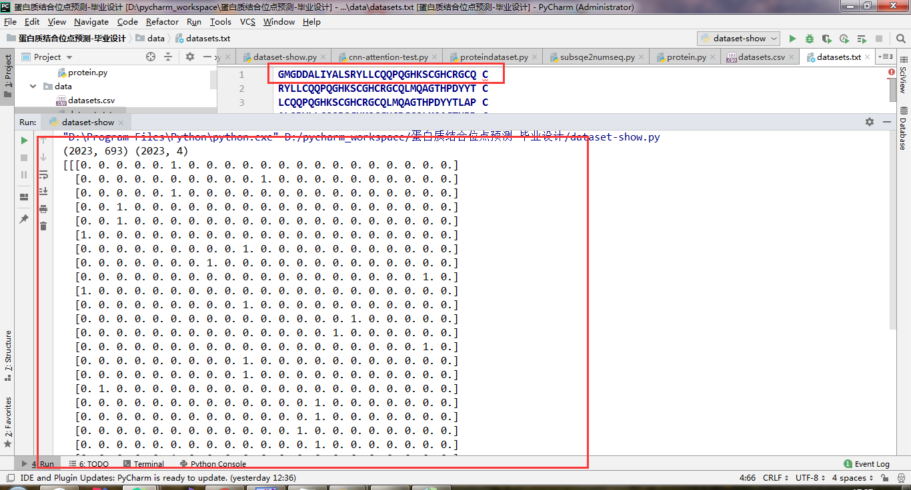
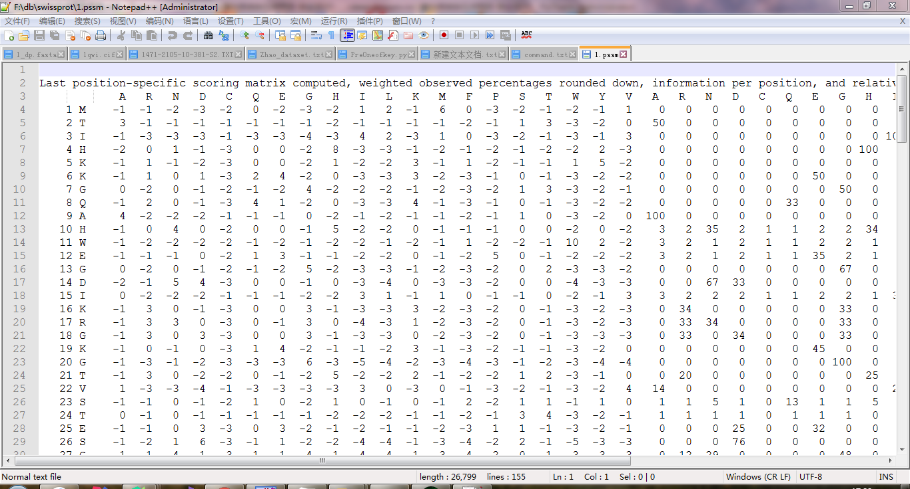
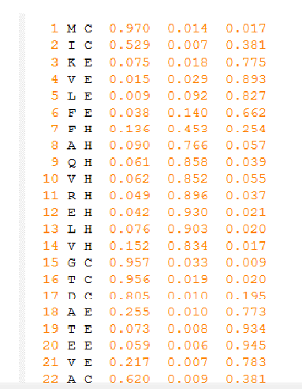
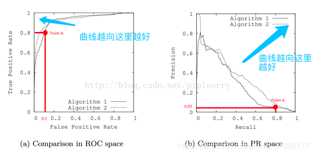

# 
 锌结合蛋白质结合位点预测 

## 数据集

- 蛋白质相关数据库：

  | 数据库  | 物种    | 描述                                                         |
  | ------- | ------- | ------------------------------------------------------------ |
  | Bind    | Many    | 生物分子相互作用数据库                                       |
  | BioGrid | Many    | 蛋白质-蛋白质以及基因相互作用的数据库                        |
  | DIP     | Many    | 相互作用的蛋白质数据库                                       |
  | HPID    | Human   | 人类蛋白质相互作用数据库                                     |
  | HPRD    | Human   | 人类蛋白质参考数据库                                         |
  | IntAct  | Many    | EBI 的蛋白质相互作用数据库                                   |
  | MINT    | Many    | 分子相互作用数据库                                           |
  | MIPS    | Mammals | 哺乳动物蛋白质相互作用数据库                                 |
  | OPHID   | Human   | 在线预测人类相互作用数据库                                   |
  | STRING  | Many    | 实验和生物信息学方法预测的蛋白质网络数据库                   |
  | PDB     | Many    | 国际上唯一的生物大分子结构数据库，主要包括蛋白质、核酸等实验测定的结构信息 |
  | ProSite | Many    | 收集了生物学有显著意义的蛋白质位点和序列模式，并能快速鉴别蛋白质属于相应的蛋白质家族 |
  
  

- 20 种基本氨基酸

  | 氨基酸   | 三字母 | 单字母 |
  | -------- | ------ | ------ |
  | 丙氨酸   | Ala    | A      |
  | 精氨酸   | Arg    | R      |
  | 天冬氨酸 | Asp    | D      |
  | 半胱氨酸 | Cys    | C      |
  | 谷氨酰胺 | Gln    | Q      |
  | 谷氨酸   | Glu    | E      |
  | 组氨酸   | His    | H      |
  | 异亮氨酸 | Ile    | I      |
  | 甘氨酸   | Gly    | G      |
  | 天冬酰胺 | Asn    | N      |
  | 亮氨酸   | Leu    | L      |
  | 赖氨酸   | Lys    | K      |
  | 甲硫氨酸 | Met    | M      |
  | 苯丙氨酸 | Phe    | F      |
  | 脯氨酸   | Pro    | P      |
  | 丝氨酸   | Ser    | S      |
  | 苏氨酸   | Thr    | T      |
  | 色氨酸   | Trp    | W      |
  | 酪氨酸   | Tyr    | Y      |
  | 缬氨酸   | Val    | V      |

  

- 数据集（具体数据集采用了 [**Zhao_dataset**](http://systbio.cau.edu.cn/ZincExplorer/index.php?page=download)  数据集）:
  - 多特征融合
    
  - 
    
    - 氨基酸的离散型编码
    
      深度学习框架可以以长度为 33 的蛋白质片段作为输入，但原始的蛋白质片段数据是由氨基酸字母表示的类别数据，需要对其进行数值转化才能变成可计算的数据。这里参考普遍用于自然语言处理问题中的编码方式，既 one-of-K 编码。在one-of-K 编码中，K 代表字典的大小，对于氨基酸的编码 K 可以等于 20 代表 20 种常见的氨基酸，每一个氨基酸都用一个维度为 20 的向量表示，只有对应这个氨基酸的位置是 1 其他位置都是 0。然而对于那些蛋白质片段长度不足 33 的，需要用额外的特殊符号
    “-”表示，因此实际的 K=21。对于其他非常见氨基酸或者不确定的氨基酸，例如一般蛋白质数据库中以 X 表示的氨基酸，其编码向量所有位置的值都为 0.05，代表 20 种氨基酸的均匀分布。最终，一个长度为 33 的蛋白质序列片段可以用 33×21 的矩阵表示，其具体的 one-of-21 编码方式如图 下图 所示。接下来的深度学习框架将以该编码方式的蛋白质片段作为输入。 
    
      
    
      
    
    - 蛋白质PSSM 位置特异性得分矩阵
    
      位置特异性打分矩阵（PSSM）由蛋白质序列在数据库中迭代进行多序列比对得到。生物进化理论认为，如果两种生物体是由同一个祖先进化而来，则它们的遗传物质会倾向于具有一定的相似性。也就是说同源物种的遗传物质在整个演化进程中不断地通过局部的序列缺失和重组以及部分碱基的替换等方式进行演变，从而造成了物种之间的显性差异。而多序列比对的方法能够提取出蛋白质序列中所包含的相似性信息，并由此寻找序列中能够决定生物体性状的序列模式。以 Lichtarge 和 Thornton 等人的研究为代表的目前已有的一些结果表明演化信息的重要度评分越高，则该位置的残基是结合位点的可能性越大。因此，使用位置特异性打分矩阵作为预测蛋白质结合位点的特征，具有合理性。
    
      计算得到的 PSSM 矩阵是一个二维数组，第一维是蛋白质序列中的特定位置，第二维表示 20 种标准氨基酸在蛋白质序列中特定位置出现的可能性.
    
      
    
    
    
    - Bi-gram 特征
    - 伪氨基酸组成（PseAAC）特征
    
    - 蛋白质二级结构
    
      ​		蛋白质的二级结构特征主要反映的是局部空间构象，这种构象是重复的且有规则的。蛋白质序列主链原子的三维空间排列就是蛋白质的空间构象，这种排布在一定程度上可以决定蛋白质的功能作用。由于蛋白质序列上的各个氨基酸连接起来的肽链的不断运动，使得蛋白质链的构象有很多，这就形成了蛋白质的二级结构，包括：α-螺旋，β-转角以及β-折叠和无规卷曲。
    
      ​		二级结构的数据形式与 PSSM 得分矩阵相同，我们需要将蛋白质的序列文件提交给
      软件作为输入，之后就会返回一个包含蛋白质二级结构的文件，这个文件内容如下图所示。
    
      
    
      
    
    - 蛋白质理化属性
    
      1.疏水性指数（Hydrophobicity index） 
      2.平均极性（Mean polarity） 
      3.正电荷（Positive charge） 
      4.负电荷（Negative charge） 
      5.溶剂可及表面积（Accessible surface area） 
    
      
    
    - 滑动窗口技术（一般是由经验值给出，后期通过算法进行优化对比）
    
      
    
  - 数据问题
    
    - 正负样本数据不平衡问题（可以尝试SOMTE过采样避免数据不平衡问题）
    
      ​		类别不平衡问题，顾名思义，即数据集中存在某一类样本，其数量远多于或远少于其他类样本，从而导致一些机器学习模型失效的问题。例如逻辑回归即不适合处理类别不平衡问题，例如逻辑回归在欺诈检测问题中，因为绝大多数样本都为正常样本，欺诈样本很少，逻辑回归算法会倾向于把大多数样本判定为正常样本，这样能达到很高的准确率，但是达不到很高的召回率。
    
      ​    	类别不平衡问题在很多场景中存在，例如欺诈检测，风控识别，在这些样本中，黑样本（一般为存在问题的样本）的数量一般远少于白样本（正常样本）。
    
      ​    	上采样(过采样)和下采样(负采样）策略是解决类别不平衡问题的基本方法之一。上采样即增加少数类样本的数量，下采样即减少多数类样本以获取相对平衡的数据集。
    
      ​    	最简单的上采样方法可以直接将少数类样本复制几份后添加到样本集中，最简单的下采样则可以直接只取一定百分比的多数类样本作为训练集。
    
      
  
- 结合位点预测

  - 分类问题 （仅仅预测给定的蛋白质序列是否存在结合位点，存在哪些位点）

  - 回归问题（预测蛋白质序列中哪些氨基酸残基是结合位点）

## 算法模型

- 常用机器学习方案（这里主要使用深度学习，当然可以结合其他的机器学习算法辅助）
  - 深度学习经典模型（需要在经典模型的基础上进行改进，比如说引入Attention机制等等）
    1. 卷积神经网络
    2. 长短期记忆网络
    3. 残差网络
    4. 胶囊网络

## 相关知识

- **锌结合位点定义**

  ​		锌离子结合位点定义为蛋白质的残基，该残基中的任意一个氮原子、氧原子或者硫原子
  与锌离子距离在 3.0 Å以内。常结合的氨基酸残基有半胱氨酸（CYS）、组氨酸（HIS）、天冬
  氦酸（ASP）、谷氨酸（GLU）、甲硫氨酸（MET)、赖氨酸（LYS)等，其中 CYS（C）、HIS
  （H）、ASP（D）、GLU（E）占所有结合位点的 90%以上，目前国内外的研究以这四类为主。

  ​		在一个蛋白质中，一个锌离子可以同时结合多个氨基酸残基。同时，一个蛋白质可以结
  合多个锌离子。与同一个锌离子相结合的 x（x=1,2,3,4）个残基记为 Znx，结合一个或两个
  氨基酸残基的锌离子（Zn1 和 Zn2）通常位于蛋白质结构的表面，不参加任何化学反应，没
  有实际的生物学意义；结合三个氨基酸残基的锌离子（Zn3）通常作为酶的辅因子，具有催
  化作用；结合四个氨基酸残基的锌离子（Zn4）具有稳定蛋白质结构的作用。

  

- **预测工具的获得**

  1. ZincExplorer
  2. ZincFinder
  3. ZincPred

## 实践中的问题记录

- **问题源自：如何判断一个数据集正负样本是均衡的？**

  ​		PR和ROC在面对不平衡数据时的表现是不同的。**在数据不平衡时，PR曲线是敏感的，随着正负样本比例的变化，PR会发生强烈的变化。而ROC曲线是不敏感的，其曲线能够基本保持不变。**

  ​		**ROC的面对不平衡数据的一致性表明其能够衡量<u>一个模型本身的预测能力**</u>，而这个预测能力是与样本正负比例无关的。但是这个不敏感的特性使得其较难以看出一个模型在面临样本比例变化时模型的预测情况。而PRC因为对样本比例敏感，因此能够看出分类器随着样本比例变化的效果，而实际中的数据又是不平衡的，这样有助于了解分类器实际的效果和作用，也能够以此进行模型的改进。

  ​		综上，在实际学习中，我们可以使用ROC来判断两个分类器的优良，然后进行分类器的选择，然后可以根据PRC表现出来的结果衡量一个分类器面对不平衡数据进行分类时的能力，从而进行模型的改进和优化。

  > real world data经常会面临class imbalance问题，即正负样本比例失衡。根据计算公式可以推知，**在testing set出现**imbalance时ROC曲线能保持不变，而PR则会出现大变化。

- **PRC的相对优势**

  当正负样本差距不大的情况下，ROC和PR的趋势是差不多的，但是当负样本很多的时候，两者就截然不同了，ROC效果依然看似很好，但是PR上反映效果一般。解释起来也简单，假设就1个正例，100个负例，那么基本上TPR可能一直维持在100左右，然后突然降到0。这就说明PR曲线在正负样本比例悬殊较大时更能反映分类的性能。

  >
  > 在正负样本分布得极不均匀(highly skewed datasets)的情况下，PRC比ROC能更有效地反应分类器的好坏。

  

- **序列信息熵**

  ​		蛋白质序列信息熵是一个能够估计序列可变性的保守性评分，它的理论基础是 Shannon 信息论。当给定 fi，即第 i 种氨基酸在序列中的某一位置出现的频 率时，这个位置的序列信息熵可以如下式计算: 
  $$
  Entropy = - \sum_{i=1}^{d}{f_ilnf_i}\tag{1-1}
  $$
  式(1-1)中的 d 是指所有的氨基酸类型的总数。如果所有类型的氨基酸都以相同频 率出现，则：
  $$
  Entropy = -\sum_{i=1}^{n}(1/d)ln(1/d)\tag{1-2}
  $$
  序列信息熵的值代表了一个序列的可变性，当某个序列信息熵（Entropy）的值 等于 0 时，说明这个位置最保守。

   